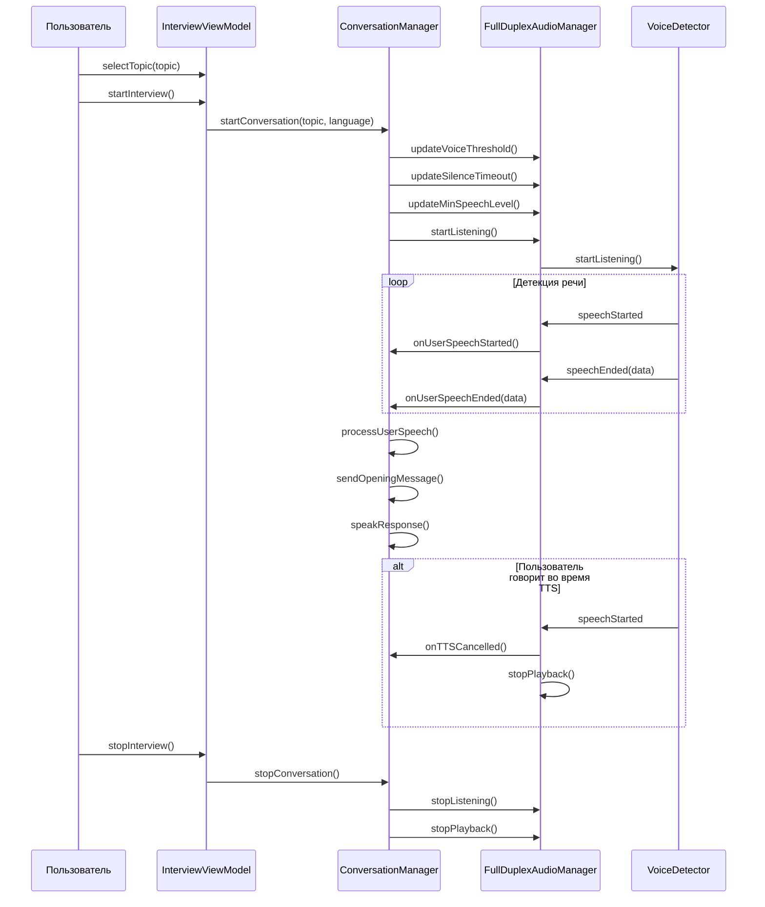

# DM_INTERVIEW.md - Функционал интервью

## Обзор

Документация системы интервью приложения MockTechInterview AI, которая управляет сессиями интервью, темами и контекстом.

## Модели интервью

### 1. InterviewSession

**Расположение:** [`MockTechInterviewAI/Domain/Models/InterviewSession.swift`](InterviewSession.swift:10)

**Описание:** Модель сессии интервью, содержащая информацию о текущем интервью.

**Свойства:**

| Свойство | Тип | По умолчанию | Описание |
|-----------|------|----------------|-----------|
| [`id`](InterviewSession.swift:11) | `UUID` | `UUID()` | Уникальный идентификатор сессии |
| [`isActive`](InterviewSession.swift:12) | `Bool` | `false` | Флаг активности сессии |
| [`startTime`](InterviewSession.swift:13) | `Date?` | `nil` | Время начала интервью |
| [`endTime`](InterviewSession.swift:14) | `Date?` | `nil` | Время окончания интервью |
| [`topic`](InterviewSession.swift:15) | `InterviewTopic` | `InterviewTopic.empty` | Тема интервью |
| [`transcript`](InterviewSession.swift:16) | `[TranscriptMessage]` | `[]` | История сообщений интервью |
| [`context`](InterviewSession.swift:17) | `InterviewContext?` | `nil` | Контекст интервью |

**Статические свойства:**

| Свойство | Тип | Описание |
|-----------|------|-----------|
| [`empty`](InterviewSession.swift:19) | `InterviewSession` | Пустая сессия |

### 2. InterviewTopic

**Расположение:** [`MockTechInterviewAI/Domain/Models/InterviewTopic.swift`](InterviewTopic.swift:10)

**Описание:** Модель темы интервью с вопросами и настройками.

**Свойства:**

| Свойство | Тип | По умолчанию | Описание |
|-----------|------|----------------|-----------|
| [`id`](InterviewTopic.swift:11) | `UUID` | `UUID()` | Уникальный идентификатор темы |
| [`title`](InterviewTopic.swift:12) | `String` | `""` | Название темы |
| [`description`](InterviewTopic.swift:13) | `String` | `""` | Описание темы |
| [`questions`](InterviewTopic.swift:14) | `[String]` | `[]` | Список вопросов |
| [`interviewMode`](InterviewTopic.swift:15) | `InterviewMode` | `.questionsOnly` | Режим интервью |
| [`language`](InterviewTopic.swift:16) | `Language` | `.english` | Язык темы |

**Статические свойства:**

| Свойство | Тип | Описание |
|-----------|------|-----------|
| [`empty`](InterviewTopic.swift:18) | `InterviewTopic` | Пустая тема |

### 3. InterviewContext

**Расположение:** [`MockTechInterviewAI/Domain/Models/InterviewContext.swift`](InterviewContext.swift:10)

**Описание:** Модель контекста интервью для сохранения состояния между сообщениями.

**Свойства:**

| Свойство | Тип | По умолчанию | Описание |
|-----------|------|----------------|-----------|
| [`sessionId`](InterviewContext.swift:11) | `UUID` | - | Идентификатор сессии интервью |
| [`previousQuestions`](InterviewContext.swift:12) | `[String]` | `[]` | Предыдущие вопросы |
| [`previousAnswers`](InterviewContext.swift:13) | `[String]` | `[]` | Предыдущие ответы |
| [`currentQuestionIndex`](InterviewContext.swift:14) | `Int` | `0` | Индекс текущего вопроса |
| [`difficultyLevel`](InterviewContext.swift:15) | `String?` | `nil` | Уровень сложности |
| [`topicsCovered`](InterviewContext.swift:16) | `[String]` | `[]` | Покрытые темы |

**Методы:**

- [`getContextSummary()`](InterviewContext.swift:18) - Возвращает текстовое резюме контекста
- [`addQuestion(_:)`](InterviewContext.swift:25) - Добавляет вопрос в историю
- [`addAnswer(_:)`](InterviewContext.swift:31) - Добавляет ответ в историю
- [`advanceQuestion()`](InterviewContext.swift:37) - Переходит к следующему вопросу
- [`reset()`](InterviewContext.swift:44) - Сбрасывает контекст

### 4. InterviewMode

**Расположение:** [`MockTechInterviewAI/Domain/Models/InterviewMode.swift`](InterviewMode.swift:10)

**Описание:** Перечисление режимов интервью.

**Варианты:**

| Режим | Описание |
|--------|-----------|
| [`questionsOnly`](InterviewMode.swift:11) | Только вопросы без кода |
| [`codeOnly`](InterviewMode.swift:12) | Только код без вопросов |
| [`hybrid`](InterviewMode.swift:13) | Гибридный режим (вопросы + код) |

**Свойства:**

| Свойство | Тип | Описание |
|-----------|------|-----------|
| [`displayName`](InterviewMode.swift:15) | `String` | Отображаемое имя режима |

### 5. TranscriptMessage

**Расположение:** [`MockTechInterviewAI/Domain/Models/TranscriptMessage.swift`](TranscriptMessage.swift:10)

**Описание:** Модель сообщения в истории интервью.

**Свойства:**

| Свойство | Тип | По умолчанию | Описание |
|-----------|------|----------------|-----------|
| [`id`](TranscriptMessage.swift:11) | `UUID` | `UUID()` | Уникальный идентификатор сообщения |
| [`role`](TranscriptMessage.swift:12) | `MessageRole` | `.user` | Роль отправителя |
| [`text`](TranscriptMessage.swift:13) | `String` | `""` | Текст сообщения |
| [`timestamp`](TranscriptMessage.swift:14) | `Date` | `Date()` | Время отправки |

**MessageRole:**

| Роль | Описание |
|-------|-----------|
| [`user`](TranscriptMessage.swift:16) | Сообщение от пользователя |
| [`assistant`](TranscriptMessage.swift:17) | Сообщение от AI |

## InterviewViewModel

**Расположение:** [`MockTechInterviewAI/Presentation/ViewModels/InterviewViewModel.swift`](../../Presentation/ViewModels/InterviewViewModel.swift:12)

**Описание:** ViewModel для управления сессией интервью и UI.

**Published свойства:**

| Свойство | Тип | По умолчанию | Описание |
|-----------|------|----------------|-----------|
| [`session`](../../Presentation/ViewModels/InterviewViewModel.swift:15) | `InterviewSession` | `InterviewSession.empty` | Текущая сессия интервью |
| [`conversationState`](../../Presentation/ViewModels/InterviewViewModel.swift:16) | `ConversationState` | `.idle` | Состояние разговора |
| [`audioLevel`](../../Presentation/ViewModels/InterviewViewModel.swift:17) | `Float` | `0.0` | Текущий уровень аудио |
| [`voiceThreshold`](../../Presentation/ViewModels/InterviewViewModel.swift:18) | `Float` | `0.15` | Порог чувствительности микрофона |
| [`errorMessage`](../../Presentation/ViewModels/InterviewViewModel.swift:19) | `String?` | `nil` | Сообщение об ошибке |
| [`code`](../../Presentation/ViewModels/InterviewViewModel.swift:20) | `String` | `""` | Код в редакторе |
| [`codeEditorViewModel`](../../Presentation/ViewModels/InterviewViewModel.swift:21) | `CodeEditorViewModel` | - | ViewModel редактора кода |
| [`topics`](../../Presentation/ViewModels/InterviewViewModel.swift:22) | `[InterviewTopic]` | `[]` | Список тем |
| [`isEditingTopic`](../../Presentation/ViewModels/InterviewViewModel.swift:23) | `Bool` | `false` | Флаг редактирования темы |
| [`topicToEdit`](../../Presentation/ViewModels/InterviewViewModel.swift:24) | `InterviewTopic?` | `nil` | Редактируемая тема |

**Основные методы:**

- [`loadTopics()`](../../Presentation/ViewModels/InterviewViewModel.swift:111) - Загружает темы из репозитория
- [`addTopic(_:)`](../../Presentation/ViewModels/InterviewViewModel.swift:125) - Добавляет новую тему
- [`updateTopic(_:)`](../../Presentation/ViewModels/InterviewViewModel.swift:135) - Обновляет тему
- [`deleteTopic(id:)`](../../Presentation/ViewModels/InterviewViewModel.swift:149) - Удаляет тему
- [`startEditingTopic(_:)`](../../Presentation/ViewModels/InterviewViewModel.swift:163) - Начинает редактирование темы
- [`cancelEditing()`](../../Presentation/ViewModels/InterviewViewModel.swift:168) - Отменяет редактирование
- [`startInterview()`](../../Presentation/ViewModels/InterviewViewModel.swift:173) - Начинает интервью
- [`stopInterview()`](../../Presentation/ViewModels/InterviewViewModel.swift:196) - Останавливает интервью
- [`toggleRecording()`](../../Presentation/ViewModels/InterviewViewModel.swift:204) - Переключает запись
- [`selectTopic(_:)`](../../Presentation/ViewModels/InterviewViewModel.swift:213) - Выбирает тему

**Вычисляемые свойства:**

| Свойство | Тип | Описание |
|-----------|------|-----------|
| [`isRecording`](../../Presentation/ViewModels/InterviewViewModel.swift:244) | `Bool` | Флаг записи |
| [`canRecord`](../../Presentation/ViewModels/InterviewViewModel.swift:248) | `Bool` | Можно ли записывать |
| [`recordingButtonText`](../../Presentation/ViewModels/InterviewViewModel.swift:252) | `String` | Текст кнопки записи |
| [`statusText`](../../Presentation/ViewModels/InterviewViewModel.swift:256) | `String` | Текст статуса |

## TopicsRepository

**Расположение:** [`MockTechInterviewAI/Data/Repositories/TopicsRepository.swift`](../../Data/Repositories/TopicsRepository.swift)

**Описание:** Репозиторий для управления темами интервью.

**Основные методы:**

- `loadTopics()` - Загружает темы из хранилища
- `addTopic(_:)` - Добавляет новую тему
- `updateTopic(_:)` - Обновляет тему
- `deleteTopic(id:)` - Удаляет тему

## Поток интервью



## Состояния интервью

### Активное интервью

**Условия:**
- `session.isActive == true`
- `session.startTime != nil`
- `session.endTime == nil`

**Действия:**
- Прослушивание микрофона
- Детекция речи
- Транскрибация речи
- Генерация ответов AI
- Воспроизведение TTS

### Неактивное интервью

**Условия:**
- `session.isActive == false`
- `session.endTime != nil`

**Действия:**
- Остановка прослушивания
- Остановка воспроизведения
- Сохранение сессии

## Темы интервью

### Создание темы

**Метод:** [`InterviewViewModel.addTopic(_:)`](../../Presentation/ViewModels/InterviewViewModel.swift:125)

**Параметры:**
- `InterviewTopic` - Новая тема

**Процесс:**
1. Добавление темы в репозиторий
2. Перезагрузка списка тем
3. Обновление UI

### Редактирование темы

**Метод:** [`InterviewViewModel.updateTopic(_:)`](../../Presentation/ViewModels/InterviewViewModel.swift:135)

**Параметры:**
- `InterviewTopic` - Обновленная тема

**Процесс:**
1. Обновление темы в репозитории
2. Перезагрузка списка тем
3. Обновление темы в сессии, если она выбрана

### Удаление темы

**Метод:** [`InterviewViewModel.deleteTopic(id:)`](../../Presentation/ViewModels/InterviewViewModel.swift:149)

**Параметры:**
- `UUID` - Идентификатор темы

**Процесс:**
1. Удаление темы из репозитория
2. Перезагрузка списка тем
3. Выбор другой темы, если удалена текущая

## Контекст интервью

### Инициализация контекста

**Метод:** [`InterviewContext(sessionId:)`](InterviewContext.swift:10)

**Параметры:**
- `UUID` - Идентификатор сессии

**Инициализация:**
- `sessionId` = переданный идентификатор
- `previousQuestions` = пустой массив
- `previousAnswers` = пустой массив
- `currentQuestionIndex` = 0
- `difficultyLevel` = nil
- `topicsCovered` = пустой массив

### Резюме контекста

**Метод:** [`InterviewContext.getContextSummary()`](InterviewContext.swift:18)

**Возвращает:** `String` - Текстовое резюме контекста

**Формат:**
```
Session ID: {sessionId}
Questions asked: {count}
Topics covered: {topics}
Current question index: {index}
Difficulty: {level}
```

### Добавление вопроса

**Метод:** [`InterviewContext.addQuestion(_:)`](InterviewContext.swift:25)

**Параметры:**
- `String` - Текст вопроса

**Действия:**
1. Добавление вопроса в `previousQuestions`
2. Увеличение `currentQuestionIndex`

### Добавление ответа

**Метод:** [`InterviewContext.addAnswer(_:)`](InterviewContext.swift:31)

**Параметры:**
- `String` - Текст ответа

**Действия:**
1. Добавление ответа в `previousAnswers`

### Сброс контекста

**Метод:** [`InterviewContext.reset()`](InterviewContext.swift:44)

**Действия:**
1. Очистка `previousQuestions`
2. Очистка `previousAnswers`
3. Сброс `currentQuestionIndex` в 0
4. Сброс `difficultyLevel` в nil
5. Очистка `topicsCovered`

## Связанные файлы

- [`InterviewSession.swift`](InterviewSession.swift:10) - Модель сессии интервью
- [`InterviewTopic.swift`](InterviewTopic.swift:10) - Модель темы интервью
- [`InterviewContext.swift`](InterviewContext.swift:10) - Модель контекста интервью
- [`InterviewMode.swift`](InterviewMode.swift:10) - Режимы интервью
- [`TranscriptMessage.swift`](TranscriptMessage.swift:10) - Модель сообщения в истории
- [`InterviewViewModel.swift`](../../Presentation/ViewModels/InterviewViewModel.swift:12) - ViewModel интервью
- [`TopicsRepository.swift`](../../Data/Repositories/TopicsRepository.swift) - Репозиторий тем
