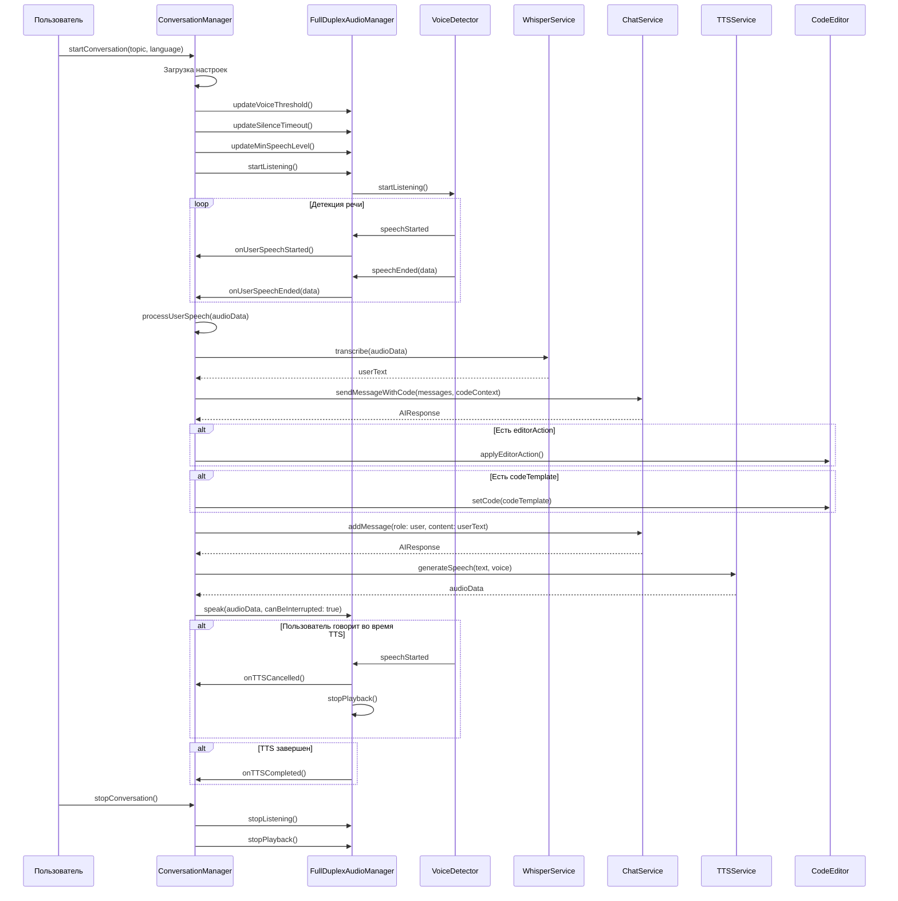

# DM_CONVERSATION.md - Функционал разговора

## Обзор

Документация системы разговора (Conversation Manager) приложения MockTechInterview AI, которая управляет потоком сообщений между пользователем и AI.

## ConversationManager

**Расположение:** [`MockTechInterviewAI/Shared/Domain/Managers/ConversationManager.swift`](ConversationManager.swift:23)

**Описание:** Менеджер для управления полнодуплексным разговором между пользователем и AI.

**Published свойства:**

| Свойство | Тип | По умолчанию | Описание |
|-----------|------|----------------|-----------|
| [`conversationState`](ConversationManager.swift:26) | `ConversationState` | `.idle` | Текущее состояние разговора |
| [`audioLevel`](ConversationManager.swift:27) | `Float` | `0.0` | Текущий уровень аудио |
| [`isProcessing`](ConversationManager.swift:28) | `Bool` | `false` | Флаг обработки |

**Callbacks:**

| Callback | Тип | Описание |
|----------|------|-----------|
| [`onUserMessage`](ConversationManager.swift:54) | `((String) -> Void)?` | Вызывается при получении сообщения от пользователя |
| [`onAIMessage`](ConversationManager.swift:55) | `((String) -> Void)?` | Вызывается при получении сообщения от AI |
| [`onError`](ConversationManager.swift:56) | `((String) -> Void)?` | Вызывается при ошибке |

## Состояния разговора (ConversationState)

**Расположение:** [`MockTechInterviewAI/Shared/Domain/Managers/ConversationManager.swift`](ConversationManager.swift:13)

| Состояние | Описание |
|-----------|-----------|
| [`idle`](ConversationManager.swift:14) | Разговор неактивен |
| [`listening`](ConversationManager.swift:15) | Прослушивание микрофона |
| [`processing`](ConversationManager.swift:16) | Обработка сообщения пользователя |
| [`speaking`](ConversationManager.swift:17) | Воспроизведение ответа AI |

## Компоненты ConversationManager

### Зависимости

| Компонент | Тип | Описание |
|-----------|------|-----------|
| [`audioManager`](ConversationManager.swift:32) | `FullDuplexAudioManager` | Менеджер аудио |
| [`whisperService`](ConversationManager.swift:33) | `OpenAIWhisperServiceProtocol` | Сервис транскрибации |
| [`chatService`](ConversationManager.swift:34) | `OpenAIChatServiceProtocol` | Сервис чата |
| [`ttsService`](ConversationManager.swift:35) | `OpenAITTSServiceProtocol` | Сервис TTS |
| [`settingsRepository`](ConversationManager.swift:36) | `SettingsRepositoryProtocol` | Репозиторий настроек |
| [`codeEditorViewModel`](ConversationManager.swift:39) | `CodeEditorViewModel?` | ViewModel редактора кода |

### Свойства

| Свойство | Тип | Описание |
|-----------|------|-----------|
| [`currentTopic`](ConversationManager.swift:45) | `InterviewTopic?` | Текущая тема интервью |
| [`currentMode`](ConversationManager.swift:46) | `InterviewMode` | Текущий режим интервью |
| [`conversationHistory`](ConversationManager.swift:47) | `[TranscriptMessage]` | История сообщений |
| [`currentContext`](ConversationManager.swift:48) | `InterviewContext?` | Контекст интервью |
| [`processingTask`](ConversationManager.swift:49) | `Task<Void, Never>?` | Текущая задача обработки |
| [`isStopping`](ConversationManager.swift:50) | `Bool` | Флаг остановки |

### Кодовый контекст

| Свойство | Тип | Описание |
|-----------|------|-----------|
| [`currentCodeContext`](ConversationManager.swift:40) | `CodeContext` | Текущий контекст кода |
| [`currentLevel`](ConversationManager.swift:41) | `DeveloperLevel` | Текущий уровень разработчика |

## Основные методы

### Инициализация

**Метод:** [`init(whisperService:chatService:ttsService:settingsRepository:codeEditorViewModel:developerLevel:)`](ConversationManager.swift:60)

**Параметры:**
- `whisperService: OpenAIWhisperServiceProtocol` - Сервис транскрибации
- `chatService: OpenAIChatServiceProtocol` - Сервис чата
- `ttsService: OpenAITTSServiceProtocol` - Сервис TTS
- `settingsRepository: SettingsRepositoryProtocol` - Репозиторий настроек
- `codeEditorViewModel: CodeEditorViewModel?` - ViewModel редактора кода (опционально)
- `developerLevel: DeveloperLevel` - Уровень разработчика

**Инициализация:**
1. Сохранение зависимостей
2. Создание `FullDuplexAudioManager`
3. Настройка аудио менеджера
4. Настройка биндингов

### Настройка аудио менеджера

**Метод:** [`setupAudioManager()`](ConversationManager.swift:81)

**Действия:**
1. Наблюдение за уровнем аудио
2. Настройка обработчиков событий голоса
3. Наблюдение за состоянием таймера тишины

### Начало разговора

**Метод:** [`startConversation(topic:language:context:)`](ConversationManager.swift:106)

**Параметры:**
- `topic: InterviewTopic` - Тема интервью
- `language: Language` - Язык интервью
- `context: InterviewContext?` - Контекст интервью (опционально)

**Процесс:**
1. Проверка состояния (должен быть `.idle`)
2. Загрузка настроек
3. Обновление параметров аудио:
   - [`updateVoiceThreshold()`](../../Shared/Data/Audio/FullDuplexAudioManager.swift:62)
   - [`updateSilenceTimeout()`](../../Shared/Data/Audio/FullDuplexAudioManager.swift:67)
   - [`updateMinSpeechLevel()`](../../Shared/Data/Audio/FullDuplexAudioManager.swift:72)
4. Начало прослушивания микрофона
5. Инициализация контекста кода
6. Отправка открывающего сообщения

### Остановка разговора

**Метод:** [`stopConversation()`](ConversationManager.swift:139)

**Процесс:**
1. Установка флага `isStopping`
2. Сброс состояния в `.idle`
3. Очистка текущей темы и контекста
4. Остановка аудио менеджера
5. Отмена задачи обработки
6. Сброс флага `isStopping` через 0.5 секунды

### Обработчики событий голоса

#### Обработка начала речи

**Метод:** [`handleUserSpeechStarted()`](ConversationManager.swift:164)

**Действия:**
1. Отмена текущей задачи обработки
2. Логирование события

#### Обработка окончания речи

**Метод:** [`handleUserSpeechEnded(audioData:)`](ConversationManager.swift:175)

**Параметры:**
- `audioData: Data` - Аудиоданные для транскрибации

**Процесс:**
1. Проверка состояния (не должно быть `.speaking`)
2. Переход в состояние `.processing`
3. Создание задачи обработки

#### Обработка отмены TTS

**Метод:** [`handleTTSCancelled()`](ConversationManager.swift:192)

**Действия:**
1. Переход в состояние `.listening`

#### Обработка завершения TTS

**Метод:** [`handleTTSCompleted()`](ConversationManager.swift:197)

**Действия:**
1. Переход в состояние `.listening`
2. Сброс флага `isProcessing`

## Обработка сообщений

### Отправка открывающего сообщения

**Метод:** [`sendOpeningMessage(topic:language:)`](ConversationManager.swift:205)

**Параметры:**
- `topic: InterviewTopic` - Тема интервью
- `language: Language` - Язык интервью

**Процесс:**
1. Проверка флага `isStopping`
2. Загрузка настроек
3. Проверка API ключа
4. Получение ответа от AI (пустые сообщения)
5. Применение действий редактора (если есть)
6. Проверка флага `isStopping`
7. Добавление сообщения в историю
8. Уведомление UI
9. Конвертация в речь (непрерываемое)

### Обработка речи пользователя

**Метод:** [`processUserSpeech(audioData:)`](ConversationManager.swift:290)

**Параметры:**
- `audioData: Data` - Аудиоданные для транскрибации

**Процесс:**
1. Проверка флага `isStopping`
2. Загрузка настроек
3. Проверка API ключа
4. Транскрибация аудио с техническим промптом
5. Проверка флага `isStopping`
6. Проверка пустой транскрибации
7. Добавление сообщения пользователя в историю
8. Уведомление UI
9. Обновление контекста кода
10. Получение ответа от AI
11. Применение действий редактора (если есть)
12. Проверка флага `isStopping`
13. Уведомление UI
14. Конвертация в речь (прерываемое)

### Воспроизведение ответа

**Метод:** [`speakResponse(_:language:apiKey:skipSpeechCheck:)`](ConversationManager.swift:431)

**Параметры:**
- `text: String` - Текст для воспроизведения
- `language: Language` - Язык
- `apiKey: String` - API ключ
- `skipSpeechCheck: Bool` - Пропустить проверку речи

**Процесс:**
1. Проверка флага `isStopping`
2. Генерация речи через TTS сервис
3. Проверка флага `isStopping`
4. Воспроизведение через аудио менеджер

## Интеграция с редактором кода

### Обновление контекста кода

**Метод:** [`updateCodeContext(from:)`](ConversationManager.swift:489)

**Параметры:**
- `viewModel: CodeEditorViewModel` - ViewModel редактора кода

**Действия:**
1. Создание `CodeContext` из кода редактора
2. Сохранение в `currentCodeContext`

### Обновление контекста из редактора

**Метод:** [`updateCodeContextFromEditor()`](ConversationManager.swift:497)

**Действия:**
1. Получение кода из редактора
2. Обновление `currentCodeContext`

### Применение действия редактора

**Метод:** [`applyEditorAction(_:)`](ConversationManager.swift:519)

**Параметры:**
- `action: EditorAction` - Действие редактора

**Типы действий:**

| Действие | Описание |
|-----------|-----------|
| `insert(text, location)` | Вставка текста в указанное место |
| `replace(rangeCodable, text)` | Замена текста в указанном диапазоне |
| `clear` | Очистка всего кода |
| `highlight(rangesCodable)` | Подсветка указанных диапазонов |

### Обработка оценки кода

**Метод:** [`handleEvaluation(_:)`](ConversationManager.swift:547)

**Параметры:**
- `evaluation: CodeEvaluation` - Оценка кода

**Действия:**
1. Логирование результата
2. Если код правильный → показ успеха
3. Если код неправильный → подсветка ошибок

### Применение подсказки

**Метод:** [`applyHint(_:)`](ConversationManager.swift:570)

**Параметры:**
- `hint: HintContext` - Контекст подсказки

**Типы подсказок:**

| Тип | Описание |
|------|-----------|
| `codeInsertion` | Вставка кода с подсветкой |
| `textHint` | Только текстовое объяснение |

## Управление режимом интервью

### Обновление режима интервью

**Метод:** [`updateInterviewMode(_:)`](ConversationManager.swift:509)

**Параметры:**
- `mode: InterviewMode` - Режим интервью

**Действия:**
1. Сохранение режима
2. Логирование изменения

### Обновление уровня разработчика

**Метод:** [`updateDeveloperLevel(_:)`](ConversationManager.swift:514)

**Параметры:**
- `level: DeveloperLevel` - Уровень разработчика

**Действия:**
1. Сохранение уровня
2. Логирование изменения

### Установка ViewModel редактора кода

**Метод:** [`setCodeEditorViewModel(_:level:)`](ConversationManager.swift:502)

**Параметры:**
- `viewModel: CodeEditorViewModel` - ViewModel редактора
- `level: DeveloperLevel` - Уровень разработчика

**Действия:**
1. Сохранение ViewModel
2. Сохранение уровня
3. Обновление контекста кода
4. Логирование подключения

## Поток разговора

## Обработка ошибок

### Ошибка транскрибации

**Тип:** `HTTPError.requestCancelled`

**Обработка:**
1. Логирование предупреждения
2. Сброс состояния в `.listening`
3. Сброс флага `isProcessing`

### Ошибка чата

**Обработка:**
1. Проверка флага `isStopping`
2. Логирование ошибки
3. Отправка сообщения об ошибке через `onError` callback
4. Сброс состояния в `.listening`
5. Сброс флага `isProcessing`

### Ошибка TTS

**Тип:** `NSURLErrorCancelled` или `AudioManager` error

**Обработка:**
1. Проверка флага `isStopping`
2. Логирование ошибки
3. Отправка сообщения об ошибке через `onError` callback
4. Сброс состояния в `.listening`
5. Сброс флага `isProcessing`

## Связанные файлы

- [`ConversationManager.swift`](ConversationManager.swift:23) - Менеджер разговора
- [`FullDuplexAudioManager.swift`](../../Shared/Data/Audio/FullDuplexAudioManager.swift:24) - Менеджер аудио
- [`OpenAIWhisperService.swift`](../../Shared/Data/Services/OpenAIWhisperService.swift) - Сервис транскрибации
- [`OpenAIChatService.swift`](../../Shared/Data/Services/OpenAIChatService.swift) - Сервис чата
- [`OpenAITTSService.swift`](../../Shared/Data/Services/OpenAITTSService.swift) - Сервис TTS
- [`CodeEditorViewModel.swift`](../../Shared/ViewModels/CodeEditorViewModel.swift) - ViewModel редактора кода
- [`Settings.swift`](Settings.swift:10) - Модель настроек
- [`InterviewContext.swift`](InterviewContext.swift:10) - Модель контекста интервью
