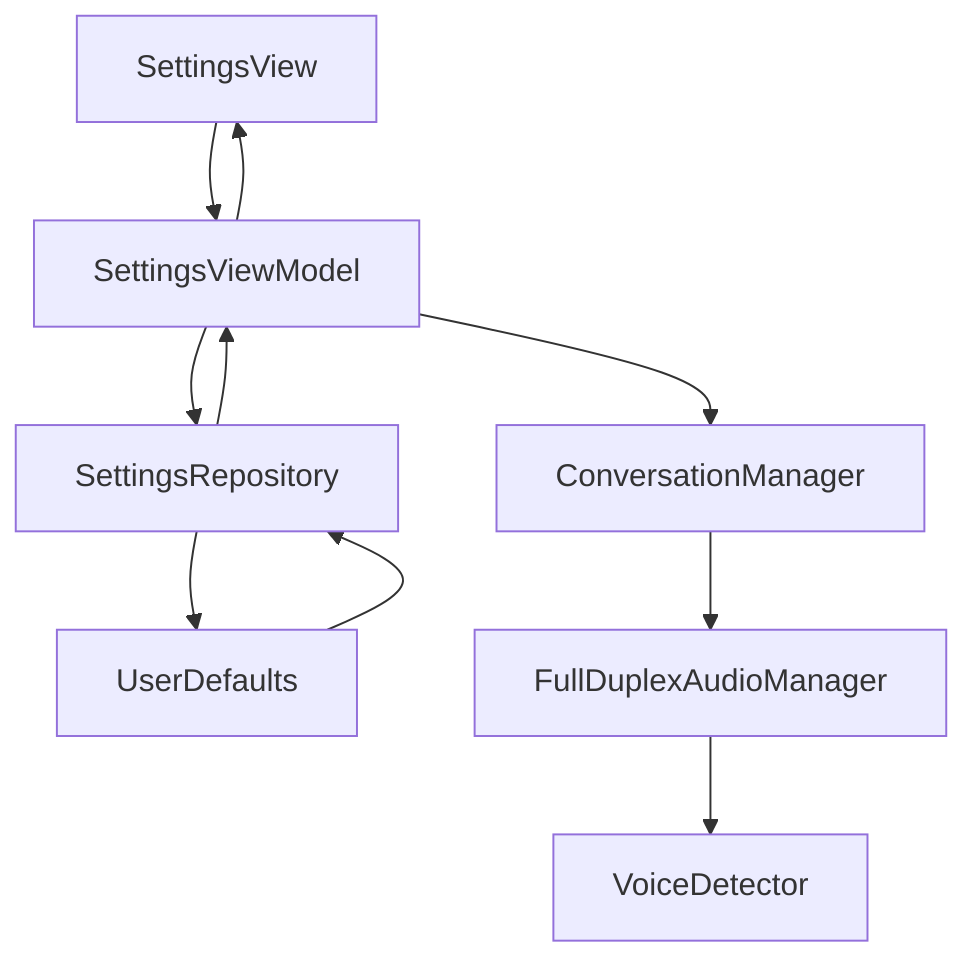

# DM_SETTINGS.md - Функционал настроек

## Обзор

Документация модели [`Settings`](Settings.swift:10) и системы настроек приложения MockTechInterview AI.

## Модель Settings

### Расположение
`MockTechInterviewAI/Shared/Domain/Models/Settings.swift`

### Описание

Модель [`Settings`](Settings.swift:10) представляет собой структуру данных для хранения пользовательских настроек и предпочтений приложения. Все настройки сохраняются в UserDefaults и автоматически загружаются при запуске приложения.

### Свойства

| Свойство | Тип | По умолчанию | Диапазон | Описание |
|-----------|------|----------------|-----------|-----------|
| [`apiKey`](Settings.swift:11) | `String` | `""` | - | OpenAI API ключ для доступа к сервисам |
| [`selectedLanguage`](Settings.swift:12) | `Language` | `.english` | - | Выбранный язык для интервью (английский, русский и др.) |
| [`selectedVoice`](Settings.swift:13) | `String` | `APIConstants.Voice.alloy` | - | Выбранный голос для TTS (alloy, echo, fable, onyx, nova, shimmer) |
| [`voiceThreshold`](Settings.swift:14) | `Float` | `0.2` | `0.05 - 0.5` | Порог чувствительности микрофона для детекции голоса |
| [`silenceTimeout`](Settings.swift:15) | `Double` | `1.5` | `0.5 - 5.0` | Время ожидания тишины после окончания речи (в секундах) |
| [`minSpeechLevel`](Settings.swift:16) | `Float` | `0.04` | `0.01 - 0.1` | Минимальный уровень аудио для валидации речи |
| [`calibratedNoiseThreshold`](Settings.swift:17) | `Float?` | `nil` | - | Последний откалиброванный порог шума (опционально) |

### Вычисляемые свойства

| Свойство | Тип | Описание |
|-----------|------|-----------|
| [`hasValidAPIKey`](Settings.swift:34) | `Bool` | Проверяет, что API ключ не пустой и имеет длину более 20 символов |

## Параметры аудио настроек

### Voice Threshold (Порог голоса)

**Описание:** Порог чувствительности микрофона для детекции начала речи.

**Диапазон:** 0.05 (очень чувствительный) - 0.5 (наименее чувствительный)

**По умолчанию:** 0.2

**Влияние:**
- **Низкие значения (0.05 - 0.15):** Очень чувствительный режим, может детектировать тихую речь, но также может реагировать на фоновые шумы
- **Средние значения (0.15 - 0.25):** Баланс между чувствительностью и фильтрацией шума (рекомендуется)
- **Высокие значения (0.25 - 0.5):** Менее чувствительный режим, фильтрует большинство шумов, но может пропускать тихую речь

**Использование:** Используется в [`VoiceDetector`](../Shared/Data/Audio/VoiceDetector.swift:64) для определения начала речи.

### Silence Timeout (Тайм-аут тишины)

**Описание:** Время ожидания тишины после окончания речи перед отправкой на транскрибацию.

**Диапазон:** 0.5 - 5.0 секунд

**По умолчанию:** 1.5 секунды

**Влияние:**
- **Короткие значения (0.5 - 1.0s):** Быстрая обработка, но может прерывать речь на паузах
- **Средние значения (1.0 - 2.0s):** Нормальный режим (рекомендуется)
- **Длинные значения (2.0 - 5.0s):** Медленная обработка, но надежно ожидает окончания речи

**Использование:** Используется в [`VoiceDetector`](../Shared/Data/Audio/VoiceDetector.swift:67) для подтверждения окончания речи.

### Min Speech Level (Минимальный уровень речи)

**Описание:** Минимальный средний уровень аудио для валидации речи. Используется для фильтрации тихих шумов, которые могут быть ошибочно приняты за речь.

**Диапазон:** 0.01 (очень снисходительный) - 0.1 (строгий)

**По умолчанию:** 0.04

**Влияние:**
- **Низкие значения (0.01 - 0.03):** Очень снисходительный режим, может принимать тихую речь, но также может принимать фоновые шумы
- **Средние значения (0.04 - 0.06):** Баланс между чувствительностью и фильтрацией шума (рекомендуется)
- **Высокие значения (0.07 - 0.1):** Строгий режим, фильтрует большинство шумов, но может пропускать тихую речь

**Использование:** Используется в [`VoiceDetector.handleSpeechEnd()`](../Shared/Data/Audio/VoiceDetector.swift:571) для валидации речи после ее окончания:

```swift
let avgLevel = calculateAverageLevel(from: trimmedData)
if avgLevel < minSpeechLevel {
    Logger.warning("VoiceDetector.audioTooQuiet() - Avg level: \(avgLevel) < \(minSpeechLevel)")
    return  // Не отправлять событие, просто перезапустить прослушивание
}
```

## Хранение настроек

### UserDefaultsKeys

**Расположение:** [`MockTechInterviewAI/Shared/Core/Constants/APIConstants.swift`](../../Shared/Core/Constants/APIConstants.swift:32)

| Ключ | Значение | Описание |
|------|-----------|-----------|
| `apiKey` | `"openai_api_key"` | OpenAI API ключ |
| `selectedLanguage` | `"selected_language"` | Выбранный язык |
| `selectedVoice` | `"selected_voice"` | Выбранный голос |
| `voiceThreshold` | `"voice_threshold"` | Порог голоса |
| `silenceTimeout` | `"silence_timeout"` | Тайм-аут тишины |
| `minSpeechLevel` | `"min_speech_level"` | Минимальный уровень речи |

### SettingsRepository

**Расположение:** [`MockTechInterviewAI/Shared/Data/Repositories/SettingsRepository.swift`](../../Shared/Data/Repositories/SettingsRepository.swift:10)

**Описание:** Репозиторий для сохранения и загрузки настроек в UserDefaults.

**Методы:**

- [`loadSettings()`](../../Shared/Data/Repositories/SettingsRepository.swift:22) - Загружает настройки из UserDefaults
- [`saveSettings(_:)`](../../Shared/Data/Repositories/SettingsRepository.swift:41) - Сохраняет настройки в UserDefaults

## SettingsViewModel

**Расположение:** [`MockTechInterviewAI/Shared/ViewModels/SettingsViewModel.swift`](../../Shared/ViewModels/SettingsViewModel.swift:12)

**Описание:** ViewModel для управления настройками в UI.

**Published свойства:**

| Свойство | Тип | По умолчанию | Описание |
|-----------|------|----------------|-----------|
| [`apiKey`](../../Shared/ViewModels/SettingsViewModel.swift:15) | `String` | `""` | OpenAI API ключ |
| [`selectedLanguage`](../../Shared/ViewModels/SettingsViewModel.swift:16) | `Language` | `.english` | Выбранный язык |
| [`selectedVoice`](../../Shared/ViewModels/SettingsViewModel.swift:17) | `String` | `APIConstants.Voice.alloy` | Выбранный голос |
| [`voiceThreshold`](../../Shared/ViewModels/SettingsViewModel.swift:18) | `Float` | `0.2` | Порог голоса |
| [`silenceTimeout`](../../Shared/ViewModels/SettingsViewModel.swift:19) | `Double` | `1.5` | Тайм-аут тишины |
| [`minSpeechLevel`](../../Shared/ViewModels/SettingsViewModel.swift:20) | `Float` | `0.04` | Минимальный уровень речи |
| [`calibratedNoiseLevel`](../../Shared/ViewModels/SettingsViewModel.swift:21) | `Float?` | `nil` | Откалиброванный уровень шума |
| [`isCalibrating`](../../Shared/ViewModels/SettingsViewModel.swift:22) | `Bool` | `false` | Флаг калибровки |
| [`calibrationProgress`](../../Shared/ViewModels/SettingsViewModel.swift:23) | `Double` | `0.0` | Прогресс калибровки |

**Методы:**

- [`loadSettings()`](../../Shared/ViewModels/SettingsViewModel.swift:44) - Загружает настройки из репозитория
- [`saveSettings()`](../../Shared/ViewModels/SettingsViewModel.swift:54) - Сохраняет настройки в репозиторий
- [`calibrateNoiseLevel()`](../../Shared/ViewModels/SettingsViewModel.swift:66) - Запускает калибровку уровня шума

## SettingsView

**Расположение:** [`MockTechInterviewAI/UI/macOS/SettingsView.swift`](../../UI/macOS/SettingsView.swift:11)

**Описание:** UI для настройки параметров приложения.

**Разделы:**

1. **API Key** - Ввод OpenAI API ключа
2. **Audio System Test** - Тестирование микрофона
3. **Interview Language** - Выбор языка интервью
4. **AI Voice** - Выбор голоса TTS
5. **Voice Threshold** - Настройка порога чувствительности микрофона
6. **Silence Timeout** - Настройка тайм-аута тишины
7. **Min Speech Level** - Настройка минимального уровня речи

## Поток данных настроек



## Калибровка уровня шума

**Описание:** Автоматическая калибровка уровня шума для оптимальной работы детекции голоса.

**Компонент:** [`AudioCalibrationManager`](../../Shared/Data/Audio/AudioCalibrationManager.swift)

**Метод:** [`SettingsViewModel.calibrateNoiseLevel()`](../../Shared/ViewModels/SettingsViewModel.swift:66)

**Процесс:**
1. Пользователь нажимает кнопку "Calibrate Noise Level (3s)"
2. Записывается 3 секунды фонового шума
3. Вычисляется средний уровень шума
4. Рекомендуемый порог устанавливается как `voiceThreshold`
5. Результат сохраняется в `calibratedNoiseThreshold`
6. Настройки автоматически сохраняются

## Рекомендации по настройке

### Для тихой среды
- **Voice Threshold:** 0.1 - 0.15 (более чувствительный)
- **Silence Timeout:** 1.0 - 1.5s (быстрый)
- **Min Speech Level:** 0.03 - 0.04 (снисходительный)

### Для шумной среды
- **Voice Threshold:** 0.25 - 0.35 (менее чувствительный)
- **Silence Timeout:** 2.0 - 3.0s (медленный)
- **Min Speech Level:** 0.05 - 0.07 (строгий)

### Для пользователей с тихим голосом
- **Voice Threshold:** 0.1 - 0.15 (более чувствительный)
- **Silence Timeout:** 2.0 - 3.0s (медленный)
- **Min Speech Level:** 0.02 - 0.03 (очень снисходительный)

## Связанные файлы

- [`Settings.swift`](Settings.swift:10) - Модель настроек
- [`SettingsRepository.swift`](../../Shared/Data/Repositories/SettingsRepository.swift:10) - Репозиторий настроек
- [`SettingsViewModel.swift`](../../Shared/ViewModels/SettingsViewModel.swift:12) - ViewModel настроек
- [`SettingsView.swift`](../../UI/macOS/SettingsView.swift:11) - UI настроек
- [`APIConstants.swift`](../../Shared/Core/Constants/APIConstants.swift:10) - Константы API и ключи UserDefaults
