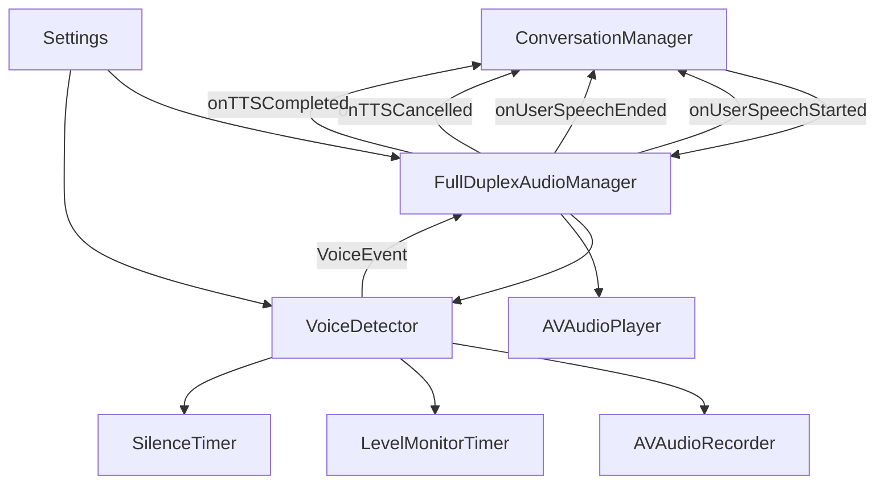

# DM_AUDIO.md - Функционал аудио системы

## Обзор

Документация аудио системы приложения XInterview2, которая обеспечивает непрерывное прослушивание микрофона и прерываемое воспроизведение TTS (Text-to-Speech).

## Архитектура аудио системы



## Компоненты аудио системы

### 1. FullDuplexAudioManager

**Расположение:** [`XInterview2/Data/Audio/FullDuplexAudioManager.swift`](../../Data/Audio/FullDuplexAudioManager.swift:24)

**Описание:** Менеджер для управления полнодуплексным аудио - одновременное прослушивание микрофона и прерываемое воспроизведение TTS.

**Состояния аудио (AudioState):**

| Состояние | Описание |
|-----------|-----------|
| `idle` | Аудио система неактивна |
| `listening` | Система прослушивает микрофон |
| `processing` | Обработка аудиоданных |
| `speaking` | Воспроизведение TTS |
| `interrupted` | TTS прерван пользователем |

**Published свойства:**

| Свойство | Тип | Описание |
|-----------|------|-----------|
| [`audioState`](../../Data/Audio/FullDuplexAudioManager.swift:27) | `AudioState` | Текущее состояние аудио |
| [`audioLevel`](../../Data/Audio/FullDuplexAudioManager.swift:28) | `Float` | Текущий уровень аудио (0.0 - 1.0) |
| [`isListening`](../../Data/Audio/FullDuplexAudioManager.swift:29) | `Bool` | Флаг прослушивания |
| [`isSpeaking`](../../Data/Audio/FullDuplexAudioManager.swift:30) | `Bool` | Флаг воспроизведения TTS |
| [`isSilenceTimerActive`](../../Data/Audio/FullDuplexAudioManager.swift:31) | `Bool` | Флаг активности таймера тишины |
| [`silenceTimerProgress`](../../Data/Audio/FullDuplexAudioManager.swift:32) | `Double` | Прогресс таймера тишины (0.0 - 1.0) |

**Callbacks:**

| Callback | Тип | Описание |
|----------|------|-----------|
| [`onUserSpeechStarted`](../../Data/Audio/FullDuplexAudioManager.swift:47) | `(() -> Void)?` | Вызывается при начале речи пользователя |
| [`onUserSpeechEnded`](../../Data/Audio/FullDuplexAudioManager.swift:48) | `((Data) -> Void)?` | Вызывается при окончании речи с аудиоданными |
| [`onTTSCancelled`](../../Data/Audio/FullDuplexAudioManager.swift:49) | `(() -> Void)?` | Вызывается при прерывании TTS |
| [`onTTSCompleted`](../../Data/Audio/FullDuplexAudioManager.swift:50) | `(() -> Void)?` | Вызывается при завершении TTS |

**Основные методы:**

- [`updateVoiceThreshold(_:)`](../../Data/Audio/FullDuplexAudioManager.swift:62) - Обновляет порог чувствительности микрофона
- [`updateSilenceTimeout(_:)`](../../Data/Audio/FullDuplexAudioManager.swift:67) - Обновляет тайм-аут тишины
- [`updateMinSpeechLevel(_:)`](../../Data/Audio/FullDuplexAudioManager.swift:72) - Обновляет минимальный уровень речи
- [`startListening()`](../../Data/Audio/FullDuplexAudioManager.swift:144) - Начинает прослушивание микрофона
- [`stopListening()`](../../Data/Audio/FullDuplexAudioManager.swift:157) - Останавливает прослушивание микрофона
- [`pauseListening()`](../../Data/Audio/FullDuplexAudioManager.swift:165) - Приостанавливает прослушивание
- [`resumeListening()`](../../Data/Audio/FullDuplexAudioManager.swift:170) - Возобновляет прослушивание
- [`speak(_:canBeInterrupted:skipSpeechCheck:)`](../../Data/Audio/FullDuplexAudioManager.swift:177) - Воспроизводит TTS аудио

### 2. VoiceDetector

**Расположение:** [`XInterview2/Data/Audio/VoiceDetector.swift`](../../Data/Audio/VoiceDetector.swift:35)

**Описание:** Детектор голосовой активности (VAD - Voice Activity Detection) для непрерывного распознавания речи.

**События голосовой активности (VoiceEvent):**

| Событие | Тип | Описание |
|-----------|------|-----------|
| [`speechStarted`](../../Data/Audio/VoiceDetector.swift:22) | - | Речь началась |
| [`speechEnded(Data)`](../../Data/Audio/VoiceDetector.swift:23) | `Data` | Речь закончилась (аудиоданные для транскрибации) |
| [`silenceDetected`](../../Data/Audio/VoiceDetector.swift:24) | - | Обнаружена тишина |
| [`error(Error)`](../../Data/Audio/VoiceDetector.swift:25) | `Error` | Произошла ошибка |

**Published свойства:**

| Свойство | Тип | Описание |
|-----------|------|-----------|
| [`isListening`](../../Data/Audio/VoiceDetector.swift:40) | `Bool` | Флаг прослушивания |
| [`audioLevel`](../../Data/Audio/VoiceDetector.swift:43) | `Float` | Текущий уровень аудио (0.0 - 1.0) |
| [`speechDetected`](../../Data/Audio/VoiceDetector.swift:46) | `Bool` | Флаг обнаружения речи |
| [`isSilenceTimerActive`](../../Data/Audio/VoiceDetector.swift:49) | `Bool` | Флаг активности таймера тишины |
| [`silenceTimerProgress`](../../Data/Audio/VoiceDetector.swift:52) | `Double` | Прогресс таймера тишины (0.0 - 1.0) |
| [`silenceTimerElapsed`](../../Data/Audio/VoiceDetector.swift:55) | `Double` | Прошедшее время в тишине (секунды) |

**Параметры конфигурации:**

| Параметр | Тип | По умолчанию | Диапазон | Описание |
|-----------|------|----------------|-----------|-----------|
| [`silenceThreshold`](../../Data/Audio/VoiceDetector.swift:61) | `Float` | `0.05` | - | Порог тишины для определения конца речи |
| [`speechStartThreshold`](../../Data/Audio/VoiceDetector.swift:64) | `Float` | `0.15` | `0.05 - 0.5` | Порог начала речи (настраивается через настройки) |
| [`silenceTimeout`](../../Data/Audio/VoiceDetector.swift:67) | `Double` | `1.5` | `0.5 - 5.0` | Тайм-аут тишины (настраивается через настройки) |
| [`minSpeechDuration`](../../Data/Audio/VoiceDetector.swift:70) | `TimeInterval` | `0.2` | - | Минимальная длительность речи для валидации |
| [`minSpeechLevel`](../../Data/Audio/VoiceDetector.swift:73) | `Float` | `0.04` | `0.01 - 0.1` | Минимальный средний уровень аудио для валидации речи |
| [`maxRecordingDuration`](../../Data/Audio/VoiceDetector.swift:76) | `TimeInterval` | `30.0` | - | Максимальная длительность записи |

**Основные методы:**

- [`updateThreshold(_:)`](../../Data/Audio/VoiceDetector.swift:170) - Обновляет порог начала речи
- [`updateSilenceTimeout(_:)`](../../Data/Audio/VoiceDetector.swift:175) - Обновляет тайм-аут тишины
- [`updateMinSpeechLevel(_:)`](../../Data/Audio/VoiceDetector.swift:180) - Обновляет минимальный уровень речи
- [`startListening()`](../../Data/Audio/VoiceDetector.swift:179) - Начинает прослушивание микрофона
- [`stopListening()`](../../Data/Audio/VoiceDetector.swift:192) - Останавливает прослушивание микрофона
- [`pauseListening()`](../../Data/Audio/VoiceDetector.swift:207) - Приостанавливает прослушивание
- [`resumeListening()`](../../Data/Audio/VoiceDetector.swift:214) - Возобновляет прослушивание

**Алгоритм детекции речи:**

1. **Мониторинг уровня аудио** (каждые 0.05 сек)
   - Получение среднего уровня мощности аудио из [`AVAudioRecorder`](../../Data/Audio/VoiceDetector.swift:82)
   - Нормализация в диапазон 0.0 - 1.0

2. **Детекция начала речи**
   - Если уровень > `speechStartThreshold` и речь не активна → речь началась
   - Сохранение времени начала речи
   - Отмена таймера тишины

3. **Продолжение речи**
   - Если уровень > `speechStartThreshold` и речь активна → речь продолжается
   - Отмена таймера тишины

4. **Детекция окончания речи**
   - Если уровень < `speechStartThreshold` и речь активна → возможно окончание речи
   - Запуск таймера тишины для подтверждения

5. **Подтверждение окончания речи**
   - После `silenceTimeout` секунд тишины → речь закончилась
   - Обрезка аудиоданных до диапазона речи
   - Валидация среднего уровня аудио (`minSpeechLevel`)
   - Отправка события `speechEnded` с аудиоданными

### 3. AudioCalibrationManager

**Расположение:** [`XInterview2/Data/Audio/AudioCalibrationManager.swift`](../../Data/Audio/AudioCalibrationManager.swift)

**Описание:** Менеджер для автоматической калибровки уровня шума микрофона.

**Основные методы:**

- [`calibrateNoiseLevel(duration:)`](../../Data/Audio/AudioCalibrationManager.swift) - Запускает калибровку уровня шума

**Процесс калибровки:**

1. Запись фонового шума в течение указанной длительности
2. Вычисление среднего уровня шума
3. Рекомендация порога чувствительности (`recommendedThreshold`)
4. Автоматическое сохранение в настройки

### 4. NoiseAnalyzer

**Расположение:** [`XInterview2/Data/Audio/NoiseAnalyzer.swift`](../../Data/Audio/NoiseAnalyzer.swift)

**Описание:** Анализатор уровня шума для оценки качества аудио.

**Основные методы:**

- [`analyzeAudioLevel(_:)`](../../Data/Audio/NoiseAnalyzer.swift) - Анализирует уровень аудио
- [`getNoiseLevel()`](../../Data/Audio/NoiseAnalyzer.swift) - Возвращает текущий уровень шума

## Поток обработки аудио

```mermaid
sequenceDiagram
    participant User as Пользователь
    participant FD as FullDuplexAudioManager
    participant VD as VoiceDetector
    participant AR as AVAudioRecorder
    participant CM as ConversationManager
    
    User->>FD: startListening()
    FD->>VD: startListening()
    VD->>AR: startRecording()
    
    loop Каждые 0.05 сек
        AR->>VD: updateMeters()
        VD->>VD: checkAudioLevel()
        alt Уровень > порог
            VD->>FD: speechStarted
            FD->>CM: onUserSpeechStarted()
        else Уровень < порог и речь активна
            VD->>VD: Запуск таймера тишины
        end
    end
    
    alt Таймер тишины истек
        VD->>VD: handleSpeechEnd()
        VD->>VD: trimWAVData()
        VD->>VD: calculateAverageLevel()
        avgLevel >= minSpeechLevel?
        alt Да
            VD->>FD: speechEnded(data)
            FD->>CM: onUserSpeechEnded(data)
        else Нет
            VD->>VD: Отклонить тихий шум
        end
    end
```

## Настройки аудио

### Порог чувствительности микрофона (Voice Threshold)

**Описание:** Порог уровня аудио, при котором считается, что речь началась.

**Настройка:** [`Settings.voiceThreshold`](Settings.swift:14)

**Обновление:** [`FullDuplexAudioManager.updateVoiceThreshold(_:)`](../../Data/Audio/FullDuplexAudioManager.swift:62) → [`VoiceDetector.updateThreshold(_:)`](../../Data/Audio/VoiceDetector.swift:170)

### Тайм-аут тишины (Silence Timeout)

**Описание:** Время ожидания тишины после падения уровня ниже порога для подтверждения окончания речи.

**Настройка:** [`Settings.silenceTimeout`](Settings.swift:15)

**Обновление:** [`FullDuplexAudioManager.updateSilenceTimeout(_:)`](../../Data/Audio/FullDuplexAudioManager.swift:67) → [`VoiceDetector.updateSilenceTimeout(_:)`](../../Data/Audio/VoiceDetector.swift:175)

### Минимальный уровень речи (Min Speech Level)

**Описание:** Минимальный средний уровень аудио для валидации речи после ее окончания.

**Настройка:** [`Settings.minSpeechLevel`](Settings.swift:16)

**Обновление:** [`FullDuplexAudioManager.updateMinSpeechLevel(_:)`](../../Data/Audio/FullDuplexAudioManager.swift:72) → [`VoiceDetector.updateMinSpeechLevel(_:)`](../../Data/Audio/VoiceDetector.swift:180)

## Обработка TTS (Text-to-Speech)

### Воспроизведение TTS

**Метод:** [`FullDuplexAudioManager.speak(_:canBeInterrupted:skipSpeechCheck:)`](../../Data/Audio/FullDuplexAudioManager.swift:177)

**Параметры:**

| Параметр | Тип | Описание |
|-----------|------|-----------|
| `audioData` | `Data` | Аудиоданные для воспроизведения |
| `canBeInterrupted` | `Bool` | Может ли TTS быть прерван пользователем |
| `skipSpeechCheck` | `Bool` | Пропустить проверку речи (для непрерываемых сообщений) |

**Процесс:**

1. Проверка валидности аудиоданных
2. Остановка текущего воспроизведения
3. Если `skipSpeechCheck` = false и пользователь говорит → отмена TTS
4. Настройка аудио сессии для воспроизведения
5. Воспроизведение через [`AVAudioPlayer`](../../Data/Audio/FullDuplexAudioManager.swift:37)
6. Если `canBeInterrupted` = true → мониторинг речи пользователя
7. При обнаружении речи → прерывание TTS

### Прерывание TTS

**Условия прерывания:**

1. Пользователь начал говорить во время воспроизведения
2. Пользователь отменил операцию

**Обработка:**

1. Остановка воспроизведения
2. Вызов [`onTTSCancelled`](../../Data/Audio/FullDuplexAudioManager.swift:49) callback
3. Переход в состояние `listening`

## Уведомления

### Silence Timer Updated

**Имя:** `.silenceTimerUpdated`

**Описание:** Уведомление об обновлении прогресса таймера тишины.

**UserInfo:**

| Ключ | Тип | Описание |
|-------|------|-----------|
| `progress` | `Double` | Прогресс таймера (0.0 - 1.0) |
| `elapsed` | `Double` | Прошедшее время (секунды) |
| `timeout` | `Double` | Тайм-аут (секунды) |

### Silence Timer Reset

**Имя:** `.silenceTimerReset`

**Описание:** Уведомление о сбросе таймера тишины.

## Формат аудио

### Параметры записи

| Параметр | Значение | Описание |
|-----------|-----------|-----------|
| Формат | `kAudioFormatLinearPCM` | PCM 16-bit |
| Частота дискретизации | 16000 Hz | 16 kHz |
| Каналы | 1 | Моно |
| Глубина | 16 bit | 16 бит на сэмпл |
| Byte order | Little Endian | Младший байт первым |

### WAV заголовок

Размер заголовка: 44 байта

Используется для совместимости с Whisper API.

## Связанные файлы

- [`FullDuplexAudioManager.swift`](../../Data/Audio/FullDuplexAudioManager.swift:24) - Менеджер полнодуплексного аудио
- [`VoiceDetector.swift`](../../Data/Audio/VoiceDetector.swift:35) - Детектор голосовой активности
- [`AudioCalibrationManager.swift`](../../Data/Audio/AudioCalibrationManager.swift) - Менеджер калибровки уровня шума
- [`NoiseAnalyzer.swift`](../../Data/Audio/NoiseAnalyzer.swift) - Анализатор уровня шума
- [`Settings.swift`](Settings.swift:10) - Модель настроек аудио
