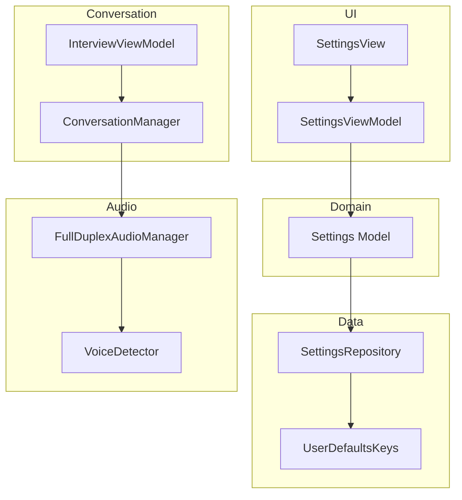
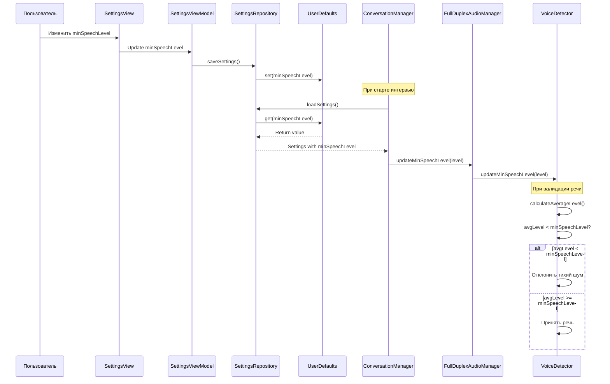

# План: Добавление настройки minSpeechLevel

## Обзор задачи

Добавить возможность настройки уровня валидации речи (`minSpeechLevel`) в окне настроек. Все параметры настроек должны сохраняться в файл и подгружаться при запуске приложения.

## Текущее состояние

- Параметр `minSpeechLevel` (значение по умолчанию: 0.04) является константой в [`VoiceDetector.swift`](XInterview2/Data/Audio/VoiceDetector.swift:73)
- Настройки сохраняются через `SettingsRepository` в UserDefaults
- Система настроек уже поддерживает: `apiKey`, `selectedLanguage`, `selectedVoice`, `voiceThreshold`, `silenceTimeout`, `calibratedNoiseThreshold`

## Архитектура настроек



## Задачи

### 1. Обновить модель Settings

**Файл:** [`XInterview2/Domain/Models/Settings.swift`](XInterview2/Domain/Models/Settings.swift)

**Изменения:**
- Добавить свойство `minSpeechLevel: Float` (диапазон: 0.01 - 0.1, по умолчанию: 0.04)
- Обновить инициализатор для включения нового параметра
- Добавить описание параметра в комментарии

```swift
var minSpeechLevel: Float  // Минимальный средний уровень аудио для валидации речи (0.01 - 0.1)
```

### 2. Обновить UserDefaultsKeys

**Файл:** [`XInterview2/Core/Constants/APIConstants.swift`](XInterview2/Core/Constants/APIConstants.swift)

**Изменения:**
- Добавить ключ для сохранения `minSpeechLevel`

```swift
static let minSpeechLevel = "min_speech_level"
```

### 3. Обновить SettingsRepository

**Файл:** [`XInterview2/Data/Repositories/SettingsRepository.swift`](XInterview2/Data/Repositories/SettingsRepository.swift)

**Изменения:**
- В методе `loadSettings()` загрузить `minSpeechLevel` из UserDefaults
- В методе `saveSettings()` сохранить `minSpeechLevel` в UserDefaults
- Обновить создание экземпляра `Settings` для включения нового параметра

### 4. Обновить SettingsViewModel

**Файл:** [`XInterview2/Presentation/ViewModels/SettingsViewModel.swift`](XInterview2/Presentation/ViewModels/SettingsViewModel.swift)

**Изменения:**
- Добавить `@Published var minSpeechLevel: Float = 0.04`
- В методе `loadSettings()` загрузить `minSpeechLevel`
- В методе `saveSettings()` включить `minSpeechLevel` в сохраняемые настройки

### 5. Обновить SettingsView

**Файл:** [`XInterview2/Presentation/Views/SettingsView.swift`](XInterview2/Presentation/Views/SettingsView.swift)

**Изменения:**
- Добавить новый раздел UI для настройки `minSpeechLevel`
- Использовать Slider для настройки (диапазон: 0.01 - 0.1, шаг: 0.005)
- Добавить описание параметра и индикатор текущего значения

```swift
// Min Speech Level Section
VStack(alignment: .leading, spacing: 8) {
    Text("Min Speech Level")
        .font(.headline)
    
    Text("Minimum audio level to validate speech (filters quiet noises)")
        .font(.caption)
        .foregroundColor(.secondary)
    
    HStack(spacing: 16) {
        Text("Less Strict")
            .font(.caption)
            .foregroundColor(.secondary)
        
        Slider(value: $viewModel.minSpeechLevel, in: 0.01...0.1, step: 0.005)
            .frame(minWidth: 200)
        
        Text("More Strict")
            .font(.caption)
            .foregroundColor(.secondary)
    }
    
    HStack {
        Text("Current level:")
            .font(.caption)
        Text(String(format: "%.3f", viewModel.minSpeechLevel))
            .font(.caption)
            .fontWeight(.bold)
            .monospacedDigit()
        
        Spacer()
        
        // Show level indicator
        if viewModel.minSpeechLevel < 0.03 {
            Label("Very Permissive", systemImage: "speaker.wave.3.fill")
                .font(.caption)
                .foregroundColor(.green)
        } else if viewModel.minSpeechLevel < 0.05 {
            Label("Permissive", systemImage: "speaker.wave.2.fill")
                .font(.caption)
                .foregroundColor(.blue)
        } else if viewModel.minSpeechLevel < 0.07 {
            Label("Normal", systemImage: "speaker.wave.1.fill")
                .font(.caption)
                .foregroundColor(.orange)
        } else {
            Label("Strict", systemImage: "speaker.slash.fill")
                .font(.caption)
                .foregroundColor(.red)
        }
    }
    
    Text("💡 Lower values = more sensitive (may catch quiet speech)")
        .font(.caption2)
        .foregroundColor(.secondary)
}
```

### 6. Обновить VoiceDetector

**Файл:** [`XInterview2/Data/Audio/VoiceDetector.swift`](XInterview2/Data/Audio/VoiceDetector.swift)

**Изменения:**
- Изменить `minSpeechLevel` с `private let` на `private var`
- Добавить метод `updateMinSpeechLevel(_ level: Float)` для обновления параметра
- Обновить инициализатор для приема `minSpeechLevel` как параметра

```swift
private var minSpeechLevel: Float

func updateMinSpeechLevel(_ level: Float) {
    minSpeechLevel = level
    Logger.voice("VoiceDetector.minSpeechLevel updated to: \(level)")
}
```

### 7. Обновить FullDuplexAudioManager

**Файл:** [`XInterview2/Data/Audio/FullDuplexAudioManager.swift`](XInterview2/Data/Audio/FullDuplexAudioManager.swift)

**Изменения:**
- Добавить метод `updateMinSpeechLevel(_ level: Float)` для передачи параметра в `VoiceDetector`

```swift
func updateMinSpeechLevel(_ level: Float) {
    Logger.audio("Updating min speech level to: \(level)")
    voiceDetector.updateMinSpeechLevel(level)
}
```

### 8. Обновить ConversationManager

**Файл:** [`XInterview2/Domain/Managers/ConversationManager.swift`](XInterview2/Domain/Managers/ConversationManager.swift)

**Изменения:**
- В методе `startConversation()` загрузить `minSpeechLevel` из настроек
- Вызвать `audioManager.updateMinSpeechLevel(settings.minSpeechLevel)`

```swift
// Load settings and update voice threshold, silence timeout, and min speech level
let settings = settingsRepository.loadSettings()
audioManager.updateVoiceThreshold(settings.voiceThreshold)
audioManager.updateSilenceTimeout(settings.silenceTimeout)
audioManager.updateMinSpeechLevel(settings.minSpeechLevel)
Logger.info("Voice threshold: \(settings.voiceThreshold), Silence timeout: \(settings.silenceTimeout)s, Min speech level: \(settings.minSpeechLevel)")
```

## Создание DM файлов

### 9. Создать DM_SETTINGS.md

**Расположение:** `XInterview2/Domain/Models/DM_SETTINGS.md`

**Содержимое:**
- Описание модели Settings
- Список всех параметров настроек
- Диапазоны значений и значения по умолчанию
- Описание процесса сохранения/загрузки

### 10. Создать DM_AUDIO.md

**Расположение:** `XInterview2/Domain/Models/DM_AUDIO.md`

**Содержимое:**
- Описание аудио системы
- Компоненты: VoiceDetector, FullDuplexAudioManager, AudioCalibrationManager
- Параметры настройки аудио
- Поток обработки аудио

### 11. Создать DM_INTERVIEW.md

**Расположение:** `XInterview2/Domain/Models/DM_INTERVIEW.md`

**Содержимое:**
- Описание модели InterviewSession
- Описание модели InterviewTopic
- Описание модели InterviewContext
- Состояния интервью

### 12. Создать DM_CONVERSATION.md

**Расположение:** `XInterview2/Domain/Models/DM_CONVERSATION.md`

**Содержимое:**
- Описание ConversationManager
- Состояния разговора (ConversationState)
- Поток обработки сообщений
- Интеграция с аудио системой

### 13. Создать DM_VOICE_DETECTION.md

**Расположение:** `XInterview2/Domain/Models/DM_VOICE_DETECTION.md`

**Содержимое:**
- Описание VoiceDetector
- Параметры детекции голоса
- События голосовой активности (VoiceEvent)
- Алгоритм детекции речи

## Диаграмма потока данных



## Параметр minSpeechLevel

### Описание

Минимальный средний уровень аудио для валидации речи. Используется для фильтрации тихих шумов, которые могут быть ошибочно приняты за речь.

### Диапазон значений

- **Минимум:** 0.01 (очень чувствительный)
- **Максимум:** 0.1 (строгий)
- **По умолчанию:** 0.04
- **Шаг настройки:** 0.005

### Влияние на работу приложения

- **Низкие значения (0.01 - 0.03):** Более чувствительный режим, может принимать тихую речь, но также может принимать фоновые шумы
- **Средние значения (0.04 - 0.06):** Баланс между чувствительностью и фильтрацией шума (рекомендуется)
- **Высокие значения (0.07 - 0.1):** Строгий режим, фильтрует большинство шумов, но может пропускать тихую речь

### Использование в коде

В [`VoiceDetector.swift`](XInterview2/Data/Audio/VoiceDetector.swift:571) параметр используется для валидации речи после ее окончания:

```swift
let avgLevel = calculateAverageLevel(from: trimmedData)
if avgLevel < minSpeechLevel {
    Logger.warning("VoiceDetector.audioTooQuiet() - Avg level: \(avgLevel) < \(minSpeechLevel)")
    return  // Не отправлять событие, просто перезапустить прослушивание
}
```

## Тестирование

1. Открыть настройки приложения
2. Изменить значение `minSpeechLevel`
3. Сохранить настройки и закрыть окно
4. Перезапустить приложение
5. Проверить, что значение сохранено
6. Начать интервью и проверить работу детекции голоса

## Риски

- **Риск:** Слишком низкое значение может привести к ложным срабатываниям на фоновые шумы
- **Митигация:** Установить разумный минимум (0.01) и предоставить описание влияния параметра

## Дополнительные улучшения (будущее)

- Добавить автоматическую калибровку `minSpeechLevel` на основе анализа тишины
- Добавить адаптивное изменение параметра на основе паттернов речи пользователя
- Добавить отдельные настройки для разных режимов интервью
