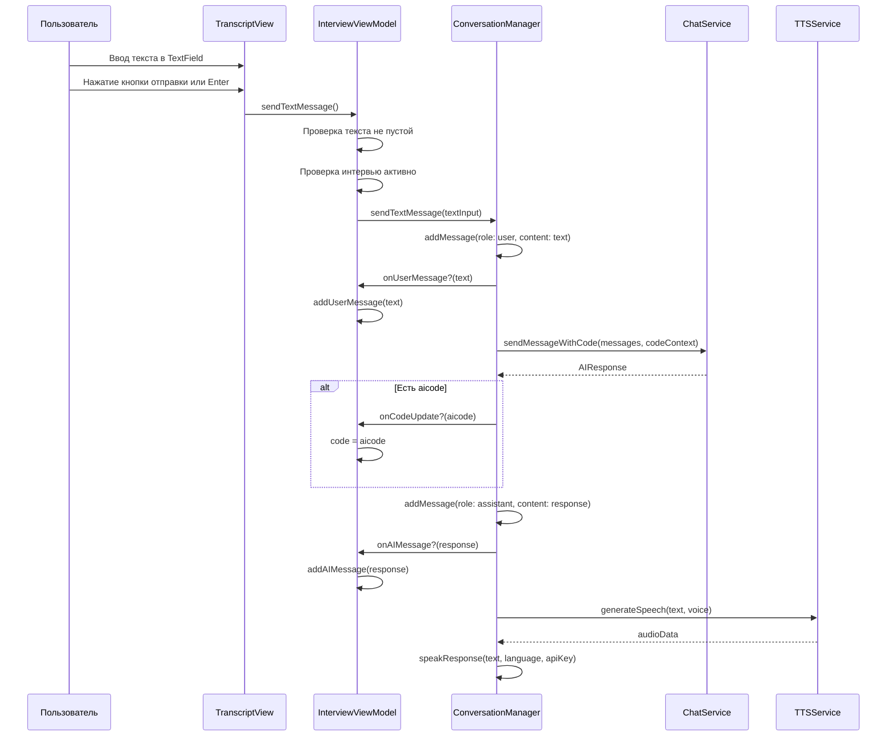

# План: Добавление текстового поля для отправки сообщений

## Обзор

Добавить текстовое двустрочное поле и кнопку для отправки сообщений под блоком чата (в панели Transcript справа). Это будет дополнительная возможность отправки сообщений для GPT вместе с голосом, минуя обработку звука и сервис Whisper.

## Диаграмма потока текстовых сообщений



## Изменения в файлах

### 1. ConversationManager.swift

**Добавить публичный метод:**

```swift
/// Отправляет текстовое сообщение пользователя минуя транскрибацию аудио
/// - Parameter text: Текст сообщения пользователя
func sendTextMessage(_ text: String) async {
    Logger.state("sendTextMessage() START - text: '\(text)'")
    
    // Проверка флага isStopping
    guard !isStopping else {
        Logger.warning("sendTextMessage() cancelled - isStopping=true")
        return
    }
    
    let settings = settingsRepository.loadSettings()
    let apiKey = settings.apiKey
    
    guard !apiKey.isEmpty else {
        Logger.error("API key is not configured")
        onError?("API key is not configured")
        return
    }
    
    do {
        // Добавляем сообщение пользователя в историю
        Logger.state("Adding user message to history")
        addMessage(role: TranscriptMessage.MessageRole.user, content: text)
        onUserMessage?(text)
        
        // Получаем ответ от AI
        guard let topic = currentTopic else {
            Logger.error("No current topic available")
            return
        }
        
        let contextSummary = currentContext?.getContextSummary() ?? ""
        
        let aiResponse = try await chatService.sendMessageWithCode(
            messages: conversationHistory,
            codeContext: currentCodeContext,
            topic: topic,
            level: currentLevel,
            language: settings.selectedLanguage,
            mode: currentMode,
            apiKey: apiKey,
            context: contextSummary
        )
        
        let response = aiResponse.spokenText
        
        // Применяем код если есть
        if let aicode = aiResponse.aicode, !aicode.isEmpty {
            onCodeUpdate?(aicode)
            Logger.success("Code set in editor: \(aicode.prefix(50))...")
        }
        
        // Проверка флага isStopping
        guard !isStopping else {
            Logger.warning("sendTextMessage() cancelled after AI response - isStopping=true")
            return
        }
        
        Logger.state("AI message: '\(response)'")
        onAIMessage?(response)
        
        // Конвертируем в речь
        Logger.state("Converting AI response to speech")
        await speakResponse(response, language: settings.selectedLanguage, apiKey: apiKey)
        
    } catch {
        guard !isStopping else {
            Logger.warning("sendTextMessage() error cancelled due to stop")
            return
        }
        
        Logger.error("Failed to send text message", error: error)
        let errorMessage = (error as? LocalizedError)?.errorDescription ?? error.localizedDescription
        onError?(errorMessage)
    }
}
```

### 2. InterviewViewModel.swift

**Добавить свойства:**

```swift
@Published var textInput: String = ""
@Published var isSendingTextMessage: Bool = false
```

**Добавить метод:**

```swift
/// Отправляет текстовое сообщение пользователя
func sendTextMessage() {
    let text = textInput.trimmingCharacters(in: .whitespacesAndNewlines)
    
    guard !text.isEmpty else {
        Logger.warning("Cannot send empty text message")
        return
    }
    
    guard session.isActive else {
        errorMessage = "Please start the interview first"
        Logger.warning("Cannot send message - interview is not active")
        return
    }
    
    isSendingTextMessage = true
    
    Task {
        await conversationManager.sendTextMessage(text)
        await MainActor.run {
            textInput = ""
            isSendingTextMessage = false
        }
    }
}
```

### 3. TranscriptView.swift

**Изменить структуру:**

```swift
struct TranscriptView: View {
    @ObservedObject var viewModel: InterviewViewModel
    @FocusState private var isTextFieldFocused: Bool
    
    var body: some View {
        VStack(alignment: .leading, spacing: 0) {
            // Header
            Text("Transcript")
                .font(.headline)
                .padding(.horizontal, 12)
                .padding(.top, 12)
            
            Divider()
            
            // Messages
            ScrollView {
                ScrollViewReader { proxy in
                    VStack(alignment: .leading, spacing: 12) {
                        if viewModel.session.transcript.isEmpty {
                            Text("No messages yet")
                                .font(.subheadline)
                                .foregroundColor(.secondary)
                                .frame(maxWidth: .infinity, alignment: .center)
                                .padding(.vertical, 40)
                        } else {
                            ForEach(viewModel.session.transcript) { message in
                                MessageRowView(message: message)
                            }
                        }
                    }
                    .padding(12)
                    .onChange(of: viewModel.session.transcript.count) { oldValue, newValue in
                        if let lastMessage = viewModel.session.transcript.last {
                            withAnimation {
                                proxy.scrollTo(lastMessage.id, anchor: .bottom)
                            }
                        }
                    }
                }
            }
            
            // Text Input Area
            Divider()
            messageInputArea
        }
        .frame(minWidth: 250)
        .background(Color(nsColor: .textBackgroundColor))
    }
    
    private var messageInputArea: some View {
        VStack(spacing: 8) {
            // Text Input Field
            TextEditor(text: $viewModel.textInput)
                .font(.body)
                .frame(minHeight: 44, maxHeight: 88) // 2-3 lines
                .scrollContentBackground(.hidden)
                .background(Color(nsColor: .textBackgroundColor))
                .cornerRadius(8)
                .overlay(
                    RoundedRectangle(cornerRadius: 8)
                        .stroke(Color.gray.opacity(0.3), lineWidth: 1)
                )
                .focused($isTextFieldFocused)
                .disabled(!viewModel.session.isActive || viewModel.isSendingTextMessage)
            
            // Send Button
            HStack {
                Spacer()
                
                Button(action: {
                    viewModel.sendTextMessage()
                    isTextFieldFocused = true
                }) {
                    HStack(spacing: 6) {
                        if viewModel.isSendingTextMessage {
                            ProgressView()
                                .scaleEffect(0.7)
                        } else {
                            Image(systemName: "paperplane.fill")
                        }
                        Text(viewModel.isSendingTextMessage ? "Sending..." : "Send")
                    }
                    .font(.subheadline)
                    .foregroundColor(.white)
                    .padding(.horizontal, 16)
                    .padding(.vertical, 8)
                    .background(canSendMessage ? Color.accentColor : Color.gray)
                    .cornerRadius(8)
                }
                .disabled(!canSendMessage)
                .buttonStyle(.plain)
            }
            .padding(.horizontal, 12)
        }
        .padding(12)
    }
    
    private var canSendMessage: Bool {
        !viewModel.textInput.trimmingCharacters(in: .whitespacesAndNewlines).isEmpty &&
        viewModel.session.isActive &&
        !viewModel.isSendingTextMessage
    }
}
```

## Проверка реализации

После реализации необходимо проверить:

1. ✅ Текстовое поле отображается внизу панели Transcript
2. ✅ Текстовое поле поддерживает ввод нескольких строк (2-3 строки)
3. ✅ Кнопка отправки отключена когда текст пустой
4. ✅ Кнопка отправки отключена когда интервью неактивно
5. ✅ Кнопка отправки показывает индикатор загрузки во время отправки
6. ✅ Сообщение пользователя добавляется в историю
7. ✅ Ответ AI получен и отображен
8. ✅ Ответ AI воспроизводится через TTS
9. ✅ Код обновляется если AI возвращает aicode
10. ✅ Текстовое поле очищается после отправки

## Связанные файлы

- [`XInterview2/Domain/Managers/ConversationManager.swift`](../XInterview2/Domain/Managers/ConversationManager.swift) - Менеджер разговора
- [`XInterview2/Presentation/ViewModels/InterviewViewModel.swift`](../XInterview2/Presentation/ViewModels/InterviewViewModel.swift) - ViewModel интервью
- [`XInterview2/Presentation/Views/TranscriptView.swift`](../XInterview2/Presentation/Views/TranscriptView.swift) - Представление транскрипции
- [`XInterview2/Data/Services/OpenAIChatService.swift`](../XInterview2/Data/Services/OpenAIChatService.swift) - Сервис чата
