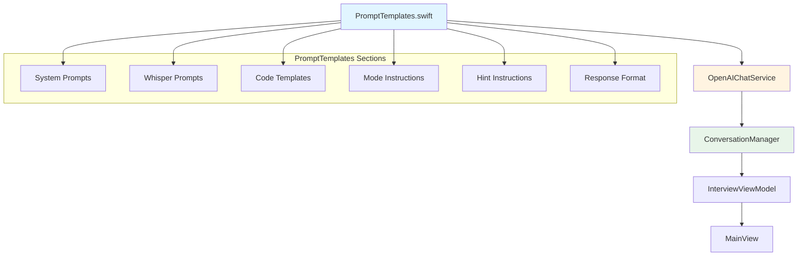

# План: Централизация промтов и исправление шаблонов кода

## Обзор задачи

1. **Централизация промтов**: Перенести все паттерны промтов в один файл для удобного редактирования и анализа
2. **Исправление шаблонов кода**: Когда GPT задает вопрос с кодом, код уже верный. Нужно добавить место для ввода своего кода.

## Текущее состояние

### Промты находятся в нескольких файлах:
1. `XInterview2/Core/Prompts/HybridInterviewPrompt.swift` - основной системный промт для интервью
2. `XInterview2/Core/Utils/WhisperPrompts.swift` - промты для Whisper API
3. `XInterview2/Data/Services/OpenAIChatService.swift` - промты для анализа и оценки кода

### Проблема с кодом в вопросах

В текущих инструкциях для режимов `codeTasks` и `hybrid` сказано:
- "Provide aicode with code template including placeholders"
- "Предоставь aicode с шаблоном включая заполнители"

Но на практике GPT часто предоставляет уже готовый, правильный код, без места для ввода.

## План реализации

### Шаг 1: Создать централизованный файл промтов

Создать файл: `XInterview2/Core/Prompts/PromptTemplates.swift`

Структура файла:
```swift
enum PromptTemplates {
    // MARK: - System Prompts
    enum System {
        // Основной системный промт для гибридного интервью
        static func hybridInterview(...) -> String
        
        // Промт для анализа ошибок в коде
        static func codeAnalysis(...) -> String
        
        // Промт для оценки кода
        static func codeEvaluation(...) -> String
    }
    
    // MARK: - Whisper Prompts
    enum Whisper {
        static let english = "..."
        static let russian = "..."
        static let german = "..."
    }
    
    // MARK: - Code Templates
    enum CodeTemplates {
        // Шаблоны кода с заполнителями для разных языков
        static func templateFor(language: CodeLanguageInterview) -> String
        
        // Примеры шаблонов с комментариями TODO
        static func exampleTemplate() -> String
    }
    
    // MARK: - Mode Instructions
    enum ModeInstructions {
        static func questionsOnly(language: Language) -> String
        static func codeTasks(language: Language) -> String
        static func hybrid(language: Language) -> String
    }
    
    // MARK: - Hint Instructions
    enum HintInstructions {
        static func forLanguage(language: Language) -> String
    }
    
    // MARK: - JSON Response Format
    enum ResponseFormat {
        static let jsonOnly = "..."
    }
}
```

### Шаг 2: Обновить инструкции для режимов codeTasks и hybrid

**Проблема**: Текущие инструкции неявные и GPT не всегда понимает, что нужно создать шаблон с заполнителями.

**Решение**: Добавить явные инструкции и примеры:

#### Для режима codeTasks (английский):
```
## Code Tasks Mode
- Give short coding challenges (1 line max)
- When presenting a task:
  1. Provide aicode with code template that includes:
     - Clear placeholder comments: `// YOUR CODE HERE`
     - Partial code structure but NOT complete solution
     - Function/method signature without implementation
     - Return placeholder value (0, "", nil, etc.) that user should replace
  2. Describe task in spoken_text (1-2 sentences max)

Example of CORRECT template:
```swift
func calculateSum(_ a: Int, _ b: Int) -> Int {
    // YOUR CODE HERE
    return 0 // Replace this line
}
```

Example of INCORRECT template (DO NOT use):
```swift
func calculateSum(_ a: Int, _ b: Int) -> Int {
    return a + b // This is already correct!
}
```

IMPORTANT: Never provide complete solution code. The user must write the implementation themselves.
```

#### Для режима hybrid (английский):
```
## Hybrid Mode
- Alternate between questions and code tasks
- Start with a question to gauge understanding
- Give code tasks (1-2 lines) when appropriate
- When presenting a task:
  1. Provide aicode with code template that includes:
     - Clear placeholder comments: `// YOUR CODE HERE`
     - Partial code structure but NOT complete solution
     - Function/method signature without implementation
     - Return placeholder value (0, "", nil, etc.) that user should replace
  2. Describe task in spoken_text (1-2 sentences max)

Example of CORRECT template:
```swift
func greet(name: String) -> String {
    // YOUR CODE HERE
    return "" // Replace this line
}
```

Example of INCORRECT template (DO NOT use):
```swift
func greet(name: String) -> String {
    return "Hello, \(name)!" // This is already correct!
}
```

IMPORTANT: Never provide complete solution code. The user must write the implementation themselves.
```

### Шаг 3: Добавить шаблоны кода для разных языков

```swift
enum CodeTemplates {
    static func templateFor(language: CodeLanguageInterview) -> String {
        switch language {
        case .swift:
            return """
            // Swift code template
            // Use // YOUR CODE HERE for placeholders
            
            func exampleFunction() -> ReturnType {
                // YOUR CODE HERE
                return defaultValue // Replace this line
            }
            """
        case .python:
            return """
            # Python code template
            # Use # YOUR CODE HERE for placeholders
            
            def example_function():
                # YOUR CODE HERE
                return None  # Replace this line
            """
        }
    }
}
```

### Шаг 4: Обновить существующие файлы

1. Обновить `HybridInterviewPrompt.swift` для использования новых шаблонов
2. Обновить `WhisperPrompts.swift` для использования новых шаблонов
3. Обновить `OpenAIChatService.swift` для использования новых шаблонов

### Шаг 5: Тестирование

После реализации необходимо протестировать:
1. Режим codeTasks - проверка что код содержит заполнители
2. Режим hybrid - проверка что код в задачах содержит заполнители
3. Режим questionsOnly - проверка что код не предоставляется
4. Whisper транскрипция - проверка что технические термины сохраняются

## Файлы для изменения

### Новые файлы:
- `XInterview2/Core/Prompts/PromptTemplates.swift` - централизованные промты

### Файлы для обновления:
- `XInterview2/Data/Services/OpenAIChatService.swift` - использовать новые шаблоны

### Файлы для удаления:
- `XInterview2/Core/Prompts/HybridInterviewPrompt.swift` - заменяется на PromptTemplates
- `XInterview2/Core/Utils/WhisperPrompts.swift` - заменяется на PromptTemplates

## Диаграмма потока промтов



## Выбранные опции

1. **Формат заполнителей**: `// YOUR CODE HERE` (более краткий формат)

2. **Язык комментариев**: Английский для технических комментариев, язык интерфейса для описания задачи

3. **Удаление старых файлов**: Полностью заменить - использовать только PromptTemplates.swift
