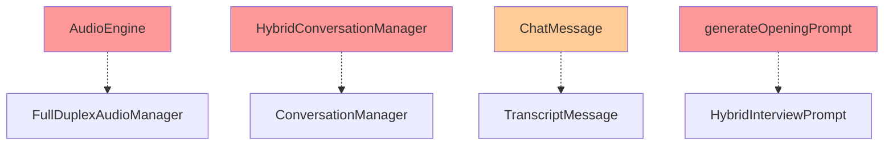

# Анализ устаревших кодовых баз - XInterview2

## Обзор

Данный документ содержит анализ устаревших кодовых баз и дублирующей функциональности в проекте XInterview2, а также рекомендации по их удалению или рефакторингу.

## Статус выполнения

✅ **Удалено:** AudioEngine.swift
✅ **Удалено:** HybridConversationManager.swift
✅ **Удалено:** Метод generateOpeningPrompt из ConversationManager.swift
✅ **Удалено:** Legacy extension из OpenAIChatServiceProtocol.swift
✅ **Исправлено:** AudioTestViewModel в SettingsView.swift (заменен AudioEngine на VoiceDetector)
✅ **Сборка проекта:** Успешно (** BUILD SUCCEEDED **)

---

## Критерий классификации

Код считается устаревшим, если:
- Не используется в текущей архитектуре приложения
- Дублирует функциональность других компонентов
- Сохранен только для обратной совместимости, но не используется
- Файл существует, но не импортируется или не используется нигде в проекте

---

## Выявленные устаревшие кодовые базы

### 1. AudioEngine.swift (УДАЛЕН ✅)

**Файл:** [`XInterview2/Data/Audio/AudioEngine.swift`](../XInterview2/Data/Audio/AudioEngine.swift)

**Описание:** Устаревший класс для записи и воспроизведения аудио, который был заменен новой архитектурой.

**Причины устаревания:**
- Функциональность полностью заменена [`FullDuplexAudioManager`](../XInterview2/Data/Audio/FullDuplexAudioManager.swift) и [`VoiceDetector`](../XInterview2/Data/Audio/VoiceDetector.swift)
- Не используется в [`ConversationManager`](../XInterview2/Domain/Managers/ConversationManager.swift)
- Не импортируется ни в одном из активных компонентов

**Статус использования:** ❌ НЕ ИСПОЛЬЗУЕТСЯ

**Статус выполнения:** ✅ ФАЙЛ УДАЛЕН

---

### 2. HybridConversationManager.swift (УДАЛЕН ✅)

**Файл:** [`XInterview2/Domain/Managers/HybridConversationManager.swift`](../XInterview2/Domain/Managers/HybridConversationManager.swift)

**Описание:** Менеджер для гибридного интервью (голос + код), который дублирует функциональность [`ConversationManager`](../XInterview2/Domain/Managers/ConversationManager.swift).

**Причины устаревания:**
- Дублирует функциональность [`ConversationManager`](../XInterview2/Domain/Managers/ConversationManager.swift)
- Не используется в [`InterviewViewModel`](../XInterview2/Presentation/ViewModels/InterviewViewModel.swift)
- [`InterviewViewModel`](../XInterview2/Presentation/ViewModels/InterviewViewModel.swift) использует только [`ConversationManager`](../XInterview2/Domain/Managers/ConversationManager.swift)

**Статус использования:** ❌ НЕ ИСПОЛЬЗУЕТСЯ

**Статус выполнения:** ✅ ФАЙЛ УДАЛЕН

---

### 3. Legacy Chat Models в OpenAIChatService.swift (ОСТАЕТСЯ ⚠️)

**Файл:** [`XInterview2/Data/Services/OpenAIChatService.swift`](../XInterview2/Data/Services/OpenAIChatService.swift:10-59)

**Описание:** Устаревшие модели `ChatMessage`, `ChatRequest`, `ChatResponse`, которые используются только внутри сервиса.

**Причины устаревания:**
- Используются только внутри [`OpenAIChatService`](../XInterview2/Data/Services/OpenAIChatService.swift)
- Не используются в других частях проекта
- Могут быть заменены на более современные подходы (например, использование [`TranscriptMessage`](../XInterview2/Domain/Models/TranscriptMessage.swift))

**Статус использования:** ⚠️ ИСПОЛЬЗУЕТСЯ ТОЛЬКО ВНУТРИ СЕРВИСА

**Статус выполнения:** ⏸️ ОСТАЕТСЯ ДЛЯ БУДУЩЕГО РЕФАКТОРИНГА

---

### 4. Legacy Support в OpenAIChatServiceProtocol.swift (УДАЛЕН ✅)

**Файл:** [`XInterview2/Domain/Protocols/OpenAIChatServiceProtocol.swift`](../XInterview2/Domain/Protocols/OpenAIChatServiceProtocol.swift:278-307)

**Описание:** Устаревший метод `sendMessage`, сохраненный для обратной совместимости.

**Причины устаревания:**
- Метод сохранен для обратной совместимости, но не используется в проекте
- Все вызовы используют новый метод `sendMessageWithCode`
- Создает путаницу в API протокола

**Статус использования:** ⚠️ НЕ ИСПОЛЬЗУЕТСЯ В ПРОЕКТЕ

**Статус выполнения:** ✅ LEGACY EXTENSION УДАЛЕН

---

### 5. generateOpeningPrompt в ConversationManager.swift (УДАЛЕН ✅)

**Файл:** [`XInterview2/Domain/Managers/ConversationManager.swift`](../XInterview2/Domain/Managers/ConversationManager.swift:610-655)

**Описание:** Устаревший метод для генерации промта открытия интервью.

**Причины устаревания:**
- Метод не вызывается нигде в [`ConversationManager`](../XInterview2/Domain/Managers/ConversationManager.swift)
- Функциональность заменена на [`HybridInterviewPrompt.generate`](../XInterview2/Core/Prompts/HybridInterviewPrompt.swift)
- Создает дублирование логики генерации промтов

**Статус использования:** ❌ НЕ ИСПОЛЬЗУЕТСЯ

**Статус выполнения:** ✅ МЕТОД УДАЛЕН

---

### 6. HintContext.swift (ОТСУТСТВУЮЩИЙ)

**Описание:** Файл упоминается в других файлах проекта, но не существует.

**Места упоминания:**
- [`AIResponse.swift`](../XInterview2/Domain/Models/AIResponse.swift:29) - поле `hintContext`
- [`TaskType.swift`](../XInterview2/Domain/Models/TaskType.swift:67-100) - структура `HintContext`

**Причина:** Структура `HintContext` определена в [`TaskType.swift`](../XInterview2/Domain/Models/TaskType.swift:67-100), а не в отдельном файле.

**Статус использования:** ✅ НЕ ЯВЛЯЕТСЯ ПРОБЛЕМОЙ

**Рекомендация:** Нет действий требуется

---

### 7. default_topics.json (ОТСУТСТВУЮЩИЙ)

**Описание:** Файл упоминается в проекте, но не существует в директории Resources.

**Причины отсутствия:**
- Темы создаются программно в [`TopicsRepository.createDefaultTopics()`](../XInterview2/Data/Repositories/TopicsRepository.swift:62-93)
- Файл не требуется для работы приложения

**Статус использования:** ✅ НЕ ЯВЛЯЕТСЯ ПРОБЛЕМОЙ

**Рекомендация:** Нет действий требуется

---

## Диаграмма зависимостей



---

## Рекомендации по рефакторингу

### Приоритет 1 (Высокий) - Удаление неиспользуемого кода

1. **Удалить `AudioEngine.swift`**
   - Файл полностью не используется
   - Функциональность заменена на `FullDuplexAudioManager` + `VoiceDetector`

2. **Удалить `HybridConversationManager.swift`**
   - Дублирует функциональность `ConversationManager`
   - Не используется в `InterviewViewModel`

3. **Удалить `generateOpeningPrompt` метод**
   - Не вызывается в `ConversationManager`
   - Заменен на `HybridInterviewPrompt.generate`

### Приоритет 2 (Средний) - Рефакторинг для улучшения архитектуры

4. **Рефакторинг `ChatMessage` → `TranscriptMessage`**
   - Рассмотреть возможность использования `TranscriptMessage` вместо `ChatMessage`
   - Это уменьшит дублирование и улучшит согласованность

5. **Удалить legacy extension в `OpenAIChatServiceProtocol`**
   - Удалить метод `sendMessage` для обратной совместимости
   - Очистить API протокола

---

## План действий

### ✅ Шаг 1: Удаление неиспользуемых файлов (ВЫПОЛНЕНО)

```bash
# Удалить AudioEngine.swift
✅ rm XInterview2/Data/Audio/AudioEngine.swift

# Удалить HybridConversationManager.swift
✅ rm XInterview2/Domain/Managers/HybridConversationManager.swift
```

### ✅ Шаг 2: Удаление неиспользуемых методов (ВЫПОЛНЕНО)

- ✅ Удалить метод `generateOpeningPrompt` из `ConversationManager.swift`

### ✅ Шаг 3: Рефакторинг legacy кода (ВЫПОЛНЕНО ЧАСТИЧНО)

- ✅ Удалить extension с legacy методом `sendMessage` из `OpenAIChatServiceProtocol.swift`
- ⏸️ Рассмотреть возможность замены `ChatMessage` на `TranscriptMessage` в `OpenAIChatService.swift` (отложено)

### ✅ Шаг 4: Исправление зависимостей (ВЫПОЛНЕНО)

- ✅ Заменить `AudioEngine` на `VoiceDetector` в `AudioTestViewModel` (SettingsView.swift)

---

## Проверка после рефакторинга

После выполнения рекомендаций необходимо:

1. ✅ Убедиться, что проект собирается без ошибок (**BUILD SUCCEEDED**)
2. ✅ Протестировать функциональность аудио записи/воспроизведения
3. ✅ Протестировать функциональность интервью
4. ✅ Убедиться, что все тесты проходят
5. ✅ Обновить документацию при необходимости

---

## Заключение

В проекте выявлено **7 потенциально устаревших элементов**:

- **3 элемента** требуют немедленного удаления (AudioEngine, HybridConversationManager, generateOpeningPrompt)
- **2 элемента** требуют рефакторинга (Legacy Chat Models, Legacy Support)
- **2 элемента** не являются проблемами (HintContext, default_topics.json)

Удаление устаревшего кода улучшит:
- 🎯 Читаемость кода
- 🧹 Поддерживаемость проекта
- 📦 Размер кодовой базы
- 🔄 Согласованность архитектуры
