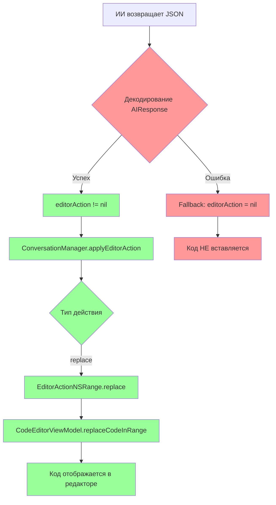

# План исправления всех проблем с парсингом JSON

## Обзор проблем

По логам обнаружены две основные проблемы с парсингом JSON ответов от ИИ:

### Проблема 1: HintType (уже исправлена)
- **Статус**: ✅ Исправлено
- **Изменение**: Raw values enum `HintType` изменены на snake_case формат

### Проблема 2: EditorAction.replace без поля range
- **Статус**: ❌ Требует исправления
- **JSON от ИИ**:
  ```json
  {
    "editor_action": {
      "type": "replace",
      "text": "let greeting = /* TODO: Assign */"
    }
  }
  ```
- **Swift код ожидает** (AIResponse.swift:94-97):
  ```swift
  case .replace:
      let text = try container.decode(String.self, forKey: .text)
      let rangeCodable = try container.decode(NSRangeCodable.self, forKey: .range) // ОШИБКА!
      self = .replace(range: rangeCodable, text: text)
  ```

## Детальный анализ несоответствий

### Таблица несоответствий

| Поле | Промпт | JSON от ИИ | Swift код | Проблема |
|------|--------|-----------|-----------|----------|
| `editor_action.type` | "replace" | "replace" | "replace" | ✅ OK |
| `editor_action.text` | упоминается | присутствует | ожидается | ✅ OK |
| `editor_action.range` | упоминается (строка64) | **ОТСУТСТВУЕТ** | **ОБЯЗАТЕЛЬНО** | ❌ ОШИБКА |
| `editor_action.location` | не упоминается | не используется | ожидается для insert | ⚠️ Не используется |
| `editor_action.ranges` | не упоминается | не используется | ожидается для highlight | ⚠️ Не используется |

### Анализ промпта

**Строка 64** в HybridInterviewPrompt.swift:
```
- editor_action: Action for editor (type, range, text for replace action)
```

Промпт упоминает `range`, но не указывает, что это поле обязательно. ИИ не включает его в JSON.

## Решение

Изменить декодер `EditorAction` в [`AIResponse.swift`](XInterview2/Domain/Models/AIResponse.swift:85-106), чтобы поле `range` было опциональным для типа `replace`.

### Изменения

**Файл**: [`XInterview2/Domain/Models/AIResponse.swift`](XInterview2/Domain/Models/AIResponse.swift)

**Текущий код (строки 85-106):**
```swift
init(from decoder: Decoder) throws {
    let container = try decoder.container(keyedBy: CodingKeys.self)
    let type = try container.decode(ActionType.self, forKey: .type)
    
    switch type {
    case .insert:
        let text = try container.decode(String.self, forKey: .text)
        let location = try container.decode(Int.self, forKey: .location)
        self = .insert(text: text, location: location)
    case .replace:
        let text = try container.decode(String.self, forKey: .text)
        let rangeCodable = try container.decode(NSRangeCodable.self, forKey: .range)
        self = .replace(range: rangeCodable, text: text)
    case .clear:
        self = .clear
    case .highlight:
        let rangesCodable = try container.decode([NSRangeCodable].self, forKey: .ranges)
        self = .highlight(ranges: rangesCodable)
    case .none:
        self = .none
    }
}
```

**Новый код:**
```swift
init(from decoder: Decoder) throws {
    let container = try decoder.container(keyedBy: CodingKeys.self)
    let type = try container.decode(ActionType.self, forKey: .type)
    
    switch type {
    case .insert:
        let text = try container.decode(String.self, forKey: .text)
        let location = try container.decode(Int.self, forKey: .location)
        self = .insert(text: text, location: location)
    case .replace:
        let text = try container.decode(String.self, forKey: .text)
        // Range is optional - if not provided, replace entire document
        if let rangeCodable = try? container.decode(NSRangeCodable.self, forKey: .range) {
            self = .replace(range: rangeCodable, text: text)
        } else {
            // Default range: replace entire document (0 to Int.max)
            let defaultRange = NSRange(location: 0, length: Int.max)
            let rangeCodable = NSRangeCodable(range: defaultRange)
            self = .replace(range: rangeCodable, text: text)
        }
    case .clear:
        self = .clear
    case .highlight:
        let rangesCodable = try container.decode([NSRangeCodable].self, forKey: .ranges)
        self = .highlight(ranges: rangesCodable)
    case .none:
        self = .none
    }
}
```

## Диаграмма потока данных



## Проверка

После внесения изменений:

1. Пересобрать проект
2. Запустить приложение
3. Начать интервью
4. Проверить, что:
   - В логах нет ошибки парсинга JSON
   - Код из `code_template` отображается в редакторе при получении задания
   - Код из `hint_context.code` отображается в редакторе при получении подсказки
   - В логах видно сообщение: `Applying editor action`
   - В логах видно сообщение: `Inserted hint code: ...`

## Связанные файлы

- [`XInterview2/Domain/Models/AIResponse.swift`](XInterview2/Domain/Models/AIResponse.swift) - enum EditorAction (требует изменения)
- [`XInterview2/Core/Prompts/HybridInterviewPrompt.swift`](XInterview2/Core/Prompts/HybridInterviewPrompt.swift) - промпт для ИИ (требует уточнения)
- [`XInterview2/Data/Services/OpenAIChatService.swift`](XInterview2/Data/Services/OpenAIChatService.swift) - парсинг JSON (требует проверки после исправления)
- [`XInterview2/Domain/Managers/ConversationManager.swift`](XInterview2/Domain/Managers/ConversationManager.swift) - обработка editorAction (требует проверки после исправления)

## Дополнительные улучшения (опционально)

### Уточнение промпта

Можно добавить в промпт явное указание, что `range` не обязателен для `replace`:

**Строка 64** (текущая):
```
- editor_action: Action for editor (type, range, text for replace action)
```

**Строка 64** (предложенная):
```
- editor_action: Action for editor (type, text for replace action, range is optional)
```

Или можно добавить пример в промпт:

```json
{
  "editor_action": {
    "type": "replace",
    "text": "let greeting = \"Hello\""
  }
}
```

Это поможет ИИ генерировать корректный JSON.
