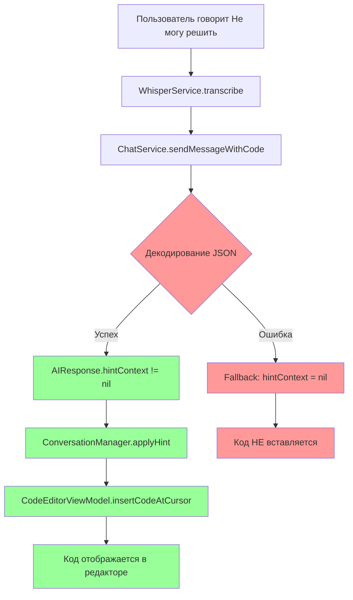

# План исправления проблемы с парсингом hint_context

## Описание проблемы

При ответе пользователя "Не могу решить" ИИ возвращает корректный JSON с подсказкой, но код не отображается в редакторе.

### Симптомы
- В логах видно, что JSON получен и содержит все необходимые данные
- Лог ошибки: `Failed to parse AI response as JSON: The data couldn't be read because it isn't in the correct format.`
- Код из поля `code` (`var optionalInt: Int? = 5`) не вставляется в редактор

### JSON ответ от ИИ
```json
{
  "task_type": "code_task",
  "spoken_text": "Declare an optional integer with a value using a question mark.",
  "hint_context": {
    "type": "code_insertion",
    "code": "var optionalInt: Int? = 5",
    "explanation": "This declares an optional integer and assigns it the value 5.",
    "highlight_range": null
  }
}
```

## Корневая причина

Несоответствие формата между тем, что указано в промпте и возвращает ИИ, и тем, что ожидает Swift код:

| Компонент | Значение в промпте/JSON | Значение в Swift коде |
|-----------|------------------------|----------------------|
| Промпт (строка 234, 262) | `"code_insertion"`, `"text_hint"` | - |
| JSON от ИИ | `"code_insertion"` | - |
| Swift enum `HintType` | - | `"codeInsertion"`, `"textHint"` |

### Последствия

1. При декодировании JSON в [`OpenAIChatService.swift:154`](XInterview2/Data/Services/OpenAIChatService.swift:154) происходит ошибка
2. Код переходит в fallback-обработчик (строки 158-186)
3. `hintContext` становится `nil`
4. В [`ConversationManager.swift:385-387`](XInterview2/Domain/Managers/ConversationManager.swift:385) метод `applyHint()` не вызывается
5. Код не вставляется в редактор

## Решение

Изменить raw values в enum `HintType` на snake_case формат, чтобы они соответствовали промпту и JSON.

### Изменения

**Файл:** [`XInterview2/Domain/Models/TaskType.swift`](XInterview2/Domain/Models/TaskType.swift)

**Текущий код (строки 61-74):**
```swift
/// Type of hint AI can provide
enum HintType: String, Codable {
    case codeInsertion   /// Insert actual code into editor
    case textHint       /// Just give a text hint/explanation
    
    var displayName: String {
        switch self {
        case .codeInsertion:
            return "Code Insertion"
        case .textHint:
            return "Text Hint"
        }
    }
}
```

**Новый код:**
```swift
/// Type of hint AI can provide
enum HintType: String, Codable {
    case codeInsertion = "code_insertion"   /// Insert actual code into editor
    case textHint = "text_hint"             /// Just give a text hint/explanation
    
    var displayName: String {
        switch self {
        case .codeInsertion:
            return "Code Insertion"
        case .textHint:
            return "Text Hint"
        }
    }
}
```

## Диаграмма потока данных



## Проверка

После внесения изменений:

1. Пересобрать проект
2. Запустить приложение
3. Начать интервью
4. Ответить "Не могу решить" на задачу
5. Проверить, что:
   - В логах нет ошибки парсинга JSON
   - Код из `hint_context.code` отображается в редакторе
   - В логах видно сообщение: `Applying hint - type: code_insertion`
   - В логах видно сообщение: `Inserted hint code: ...`

## Связанные файлы

- [`XInterview2/Domain/Models/TaskType.swift`](XInterview2/Domain/Models/TaskType.swift) - enum HintType (требует изменения)
- [`XInterview2/Core/Prompts/HybridInterviewPrompt.swift`](XInterview2/Core/Prompts/HybridInterviewPrompt.swift) - промпт для ИИ (уже корректный)
- [`XInterview2/Data/Services/OpenAIChatService.swift`](XInterview2/Data/Services/OpenAIChatService.swift) - парсинг JSON (требует проверки после исправления)
- [`XInterview2/Domain/Managers/ConversationManager.swift`](XInterview2/Domain/Managers/ConversationManager.swift) - обработка hintContext (требует проверки после исправления)
