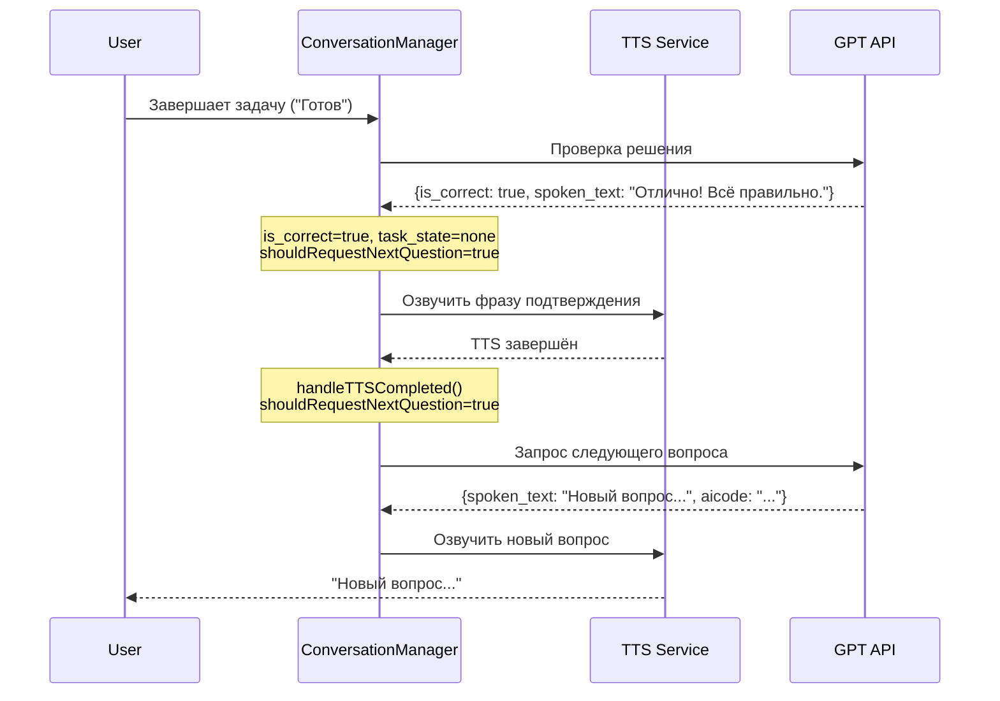

# План: Автоматический переход к следующему вопросу и разнообразные фразы подтверждения

## Анализ текущей реализации

### 1. Как работает диалог с GPT

**Текущее состояние:**
- Диалог ведётся в рамках одной сессии через `conversationHistory`
- При каждом запросе к GPT передаётся:
  1. System prompt (генерируется заново каждый раз)
  2. Вся история сообщений из `conversationHistory`
  3. Контекст кода

**Важно:** OpenAI Chat Completion API **НЕ хранит контекст** между запросами автоматически. Каждый запрос является stateless. Для поддержания контекста диалога клиент должен отправлять всю историю сообщений при каждом запросе.

**Проблема с токенами:**
- System prompt генерируется заново при каждом запросе
- История сообщений накапливается и передаётся целиком
- Это приводит к росту токенов с каждым сообщением

### 2. Текущая логика после подтверждения правильного ответа

Из [`PromptTemplates.swift`](XInterview2/Core/Prompts/PromptTemplates.swift:497-503):

```swift
Когда пользователь говорит, что закончил задачу ("Готов", "Сделал", "Всё", "Закончил", "Готово"):
- Установи task_state в "checking_solution"
- Проанализируй текущий код в редакторе
- Установи is_correct в true или false на основе анализа
- Если правильно: spoken_text должен сказать "Да, всё верно! Перейдём к следующему вопросу." и установить task_state в "none"
- КРИТИЧНО: После подтверждения правильного решения НЕМЕДЛЕННО представь следующий вопрос или задачу с кодом. НЕ повторяй сообщение подтверждения.
```

**Проблема:**
- Фраза подтверждения всегда одинаковая ("Да, всё верно! Перейдём к следующему вопросу.")
- Инструкция "НЕМЕДЛЕННО представь следующий вопрос" может не выполняться GPT корректно
- Нет гарантии, что GPT предоставит следующий вопрос в том же ответе
- Нет механизма для автоматического запроса следующего вопроса, если GPT его не предоставил

## Требуемые изменения

### 1. Разнообразные фразы подтверждения правильных ответов

**Требование:** GPT должен сам генерировать разнообразные фразы подтверждения правильных ответов, а не использовать одну и ту же статическую фразу.

**Решение:**
- Изменить промпт, чтобы GPT сам генерировал разнообразные фразы подтверждения
- Убрать статическую фразу из промпта
- Добавить инструкцию для GPT использовать разнообразные фразы

**Примеры фраз (для понимания, не статические):**
- "Да, всё верно! Перейдём к следующему вопросу."
- "Отлично! Правильно. Следующий вопрос."
- "Молодец! Всё правильно. Давай следующий вопрос."
- "Супер! Это правильный ответ. Следующий вопрос."
- "Правильно! Отличная работа. Следующий вопрос."

### 2. Автоматический запрос следующего вопроса после озвучки подтверждения

**Требование:** После сообщения об успешном выполнении нужно отправить ещё раз запрос к GPT на получение нового задания или вопроса.

**Решение:**
- В [`ConversationManager.swift`](XInterview2/Domain/Managers/ConversationManager.swift):
  - Определить, когда ответ GPT содержит подтверждение правильного решения (`isCorrect == true` и `taskState == .none`)
  - После озвучки этого сообщения (`speakResponse()` завершится через `handleTTSCompleted()`)
  - Отправить новый запрос к GPT для получения следующего вопроса
- Использовать callback `onTTSCompleted` для запуска следующего запроса

**Логика:**
```
1. GPT отвечает с is_correct=true и разнообразной фразой подтверждения
2. Фраза озвучивается через TTS
3. После завершения TTS (handleTTSCompleted) → отправляется запрос к GPT за следующим вопросом
4. GPT отвечает с новым вопросом/заданием
5. Новый вопрос озвучивается
```

### 3. Оптимизация использования токенов GPT

**Требование:** Экономить токены GPT и не следует каждый раз передавать все инструкции.

**Решение:**
- Кэшировать system prompt и переиспользовать его между запросами
- История сообщений передаётся полностью (для сохранения контекста)

**Реализация:**
- В [`OpenAIChatService.swift`](XInterview2/Data/Services/OpenAIChatService.swift):
  - Добавить кэширование system prompt
  - Переиспользовать один и тот же system prompt для всех запросов в рамках сессии

## Детальный план реализации

### Шаг 1: Обновить промпты в `PromptTemplates.swift`

**Изменения в FlowControlInstructions:**

1. **Убрать статическую фразу подтверждения:**
   - Убрать: "spoken_text должен сказать 'Да, всё верно! Перейдём к следующему вопросу.'"
   - Заменить на инструкцию использовать разнообразные фразы

2. **Убрать инструкцию о немедленном предоставлении следующего вопроса:**
   - Убрать: "КРИТИЧНО: После подтверждения правильного решения НЕМЕДЛЕННО представь следующий вопрос или задачу с кодом. НЕ повторяй сообщение подтверждения."
   - Заменить на инструкцию, что после подтверждения правильного решения:
     - GPT должен установить `is_correct: true`
     - GPT должен установить `task_state: "none"`
     - GPT должен сказать разнообразную фразу подтверждения
     - GPT НЕ должен включать следующий вопрос в ответ
     - Система сама запросит следующий вопрос

**Пример обновлённой инструкции (русский):**

```swift
Когда пользователь говорит, что закончил задачу ("Готов", "Сделал", "Всё", "Закончил", "Готово"):
- Установи task_state в "checking_solution"
- Проанализируй текущий код в редакторе
- Установи is_correct в true или false на основе анализа
- Если правильно:
  - Установи task_state в "none"
  - Установи is_correct в true
  - spoken_text должен содержать разнообразную фразу подтверждения (используй разные варианты: "Отлично!", "Молодец!", "Правильно!", "Супер!", "Всё верно!" и т.д.)
  - НЕ включай следующий вопрос в этот ответ - система сама запросит следующий вопрос
- Если неправильно:
  - Установи task_state в "providing_hint"
  - spoken_text должен дать краткую подсказку
```

### Шаг 2: Обновить `ConversationManager.swift`

**Добавить свойство для отслеживания, нужно ли запрашивать следующий вопрос:**

```swift
// Flag to track if we need to request the next question after TTS completes
private var shouldRequestNextQuestion: Bool = false
```

**В методе `handleAIResponse()`:**

1. Определить, когда ответ содержит подтверждение правильного решения:
   - `aiResponse.isCorrect == true` И `aiResponse.taskState == .none`

2. Если это подтверждение правильного решения:
   - Установить флаг `shouldRequestNextQuestion = true`

**В методе `handleTTSCompleted()`:**

1. Проверить флаг `shouldRequestNextQuestion`
2. Если установлен:
   - Отправить запрос к GPT за следующим вопросом
   - Сбросить флаг `shouldRequestNextQuestion = false`

**Новый метод для запроса следующего вопроса:**

```swift
private func requestNextQuestion() async {
    Logger.info("requestNextQuestion() called")

    guard let topic = currentTopic else {
        Logger.error("No current topic available")
        return
    }

    let settings = settingsRepository.loadSettings()
    let apiKey = settings.apiKey
    let contextSummary = currentContext?.getContextSummary() ?? ""

    do {
        isProcessingChatRequest = true
        defer { isProcessingChatRequest = false }

        let aiResponse = try await chatService.sendMessageWithCode(
            messages: conversationHistory,
            codeContext: currentCodeContext,
            topic: topic,
            level: currentLevel,
            language: settings.selectedLanguage,
            mode: currentMode,
            apiKey: apiKey,
            context: contextSummary
        )

        await handleAIResponse(aiResponse, language: settings.selectedLanguage, apiKey: apiKey)

    } catch {
        Logger.error("Failed to get next question", error: error)
        onError?(error.localizedDescription)
    }
}
```

### Шаг 3: Оптимизировать использование токенов в `OpenAIChatService.swift`

**Добавить кэширование system prompt:**

```swift
class OpenAIChatService: OpenAIChatServiceProtocol {
    private let httpClient: HTTPClient

    // Cache for system prompt
    private var cachedSystemPrompt: String?
    private var cachedPromptKey: String?

    init(httpClient: HTTPClient = DefaultHTTPClient()) {
        self.httpClient = httpClient
    }

    private func getSystemPrompt(
        topic: InterviewTopic,
        level: DeveloperLevel,
        language: Language,
        mode: InterviewMode,
        context: String
    ) -> String {
        // Create a unique key for the prompt
        let promptKey = "\(topic.id)-\(level.rawValue)-\(language.rawValue)-\(mode.rawValue)-\(context.hashValue)"

        // Return cached prompt if available
        if let cachedKey = cachedPromptKey,
           cachedKey == promptKey,
           let cachedPrompt = cachedSystemPrompt {
            return cachedPrompt
        }

        // Generate new prompt and cache it
        let newPrompt = PromptTemplates.System.hybridInterview(
            for: topic,
            level: level,
            language: language,
            mode: mode,
            context: context
        )

        cachedPromptKey = promptKey
        cachedSystemPrompt = newPrompt

        return newPrompt
    }
}
```

**Обновить метод `sendMessageWithCode()`:**

```swift
func sendMessageWithCode(
    messages: [TranscriptMessage],
    codeContext: CodeContext,
    topic: InterviewTopic,
    level: DeveloperLevel,
    language: Language,
    mode: InterviewMode,
    apiKey: String,
    context: String
) async throws -> AIResponse {

    // Use cached system prompt
    let systemPrompt = getSystemPrompt(
        topic: topic,
        level: level,
        language: language,
        mode: mode,
        context: context
    )

    var chatMessages = [ChatMessage(role: "system", content: systemPrompt)]

    // ... rest of the method
}
```

## Диаграмма потока



## Файлы для изменения

1. **Изменить:**
   - `XInterview2/Core/Prompts/PromptTemplates.swift` - обновить FlowControlInstructions для всех языков
   - `XInterview2/Domain/Managers/ConversationManager.swift` - логика автоматического запроса следующего вопроса
   - `XInterview2/Data/Services/OpenAIChatService.swift` - оптимизация токенов (кэширование system prompt)

## Резюме изменений

1. **Разнообразные фразы подтверждения:** GPT сам генерирует разнообразные фразы через обновлённый промпт
2. **Автоматический запрос следующего вопроса:** После озвучки подтверждения автоматически запрашивается следующий вопрос
3. **Оптимизация токенов:** System prompt кэшируется и переиспользуется между запросами
