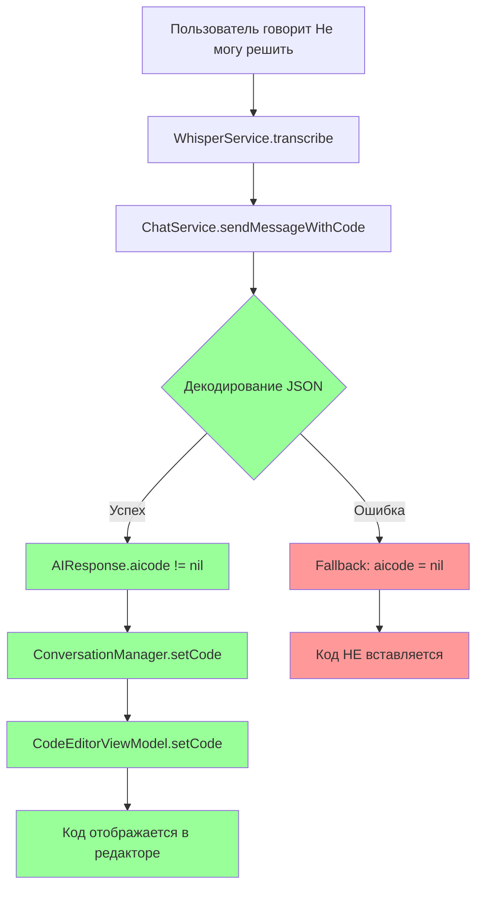

# План радикального упрощения AIResponse

## Проблема

Текущий подход с использованием сложных структур (`EditorAction`, `ActionType`, `EditorActionNSRange`) вызывает постоянные проблемы с парсингом JSON от ИИ. ИИ не всегда возвращает все обязательные поля, что приводит к ошибкам декодирования.

## Решение

Радикально упростить структуру `AIResponse`, оставив только необходимые поля.

## Новый формат AIResponse

### Текущая структура (сложная)
```swift
struct AIResponse: Codable {
    let taskType: TaskType
    let spokenText: String
    let codeTemplate: String?
    let editorAction: EditorAction?
    let evaluation: CodeEvaluation?
    let hintContext: HintContext?
}
```

### Новая структура (простая)
```swift
struct AIResponse: Codable {
    /// Text to be spoken by TTS
    let spokenText: String
    
    /// Code to display in editor (optional)
    let aicode: String?
}
```

## Изменения в файлах

### 1. XInterview2/Domain/Models/AIResponse.swift

**Удалить:**
- `taskType` поле
- `codeTemplate` поле
- `editorAction` поле
- `evaluation` поле
- `hintContext` поле
- `EditorAction` enum (весь)
- `ActionType` enum (весь)
- `EditorActionNSRange` enum (весь)

**Добавить:**
- `aicode: String?` поле

**Новый код:**
```swift
//
//  AIResponse.swift
//  XInterview2
//
//  Simplified AI response
//

import Foundation

/// Represents a simplified response from AI
struct AIResponse: Codable {
    /// Text to be spoken by TTS
    let spokenText: String
    
    /// Code to display in editor (optional)
    let aicode: String?
    
    // MARK: - Coding Keys for snake_case JSON
    
    enum CodingKeys: String, CodingKey {
        case spokenText = "spoken_text"
        case aicode
    }
    
    init(spokenText: String, aicode: String? = nil) {
        self.spokenText = spokenText
        self.aicode = aicode
    }
}
```

### 2. XInterview2/Core/Prompts/HybridInterviewPrompt.swift

**Изменить секцию "Response Format" (строки 54-73):**

**Текущий код:**
```swift
# Response Format
Always respond with valid JSON. Do not include any markdown formatting, code blocks, or explanatory text in your response.
Return ONLY JSON object with these fields:

Required fields:
- task_type: Either "question" or "code_task"
- spoken_text: Text to be spoken (keep concise, 1-2 sentences max)

Optional fields (include null if not applicable):
- code_template: For code tasks, template with TODO comments
- editor_action: Action for editor (type, range, text for replace action)
- evaluation: For completed code (is_correct, feedback, suggestions, severity, issue_lines)
- hint_context: When providing hints (type, code, explanation, highlight_range)

IMPORTANT: 
- Never use markdown code blocks (triple backticks) in your response
- Never include examples in your actual response
- Return only the raw JSON object
- Keep all text extremely short and conversational
```

**Новый код:**
```swift
# Response Format
Always respond with valid JSON. Do not include any markdown formatting, code blocks, or explanatory text in your response.
Return ONLY JSON object with these fields:

Required fields:
- spoken_text: Text to be spoken (keep concise, 1-2 sentences max)

Optional fields (include null if not applicable):
- aicode: Code to display in editor (for code tasks or hints)

IMPORTANT: 
- Never use markdown code blocks (triple backticks) in your response
- Never include examples in your actual response
- Return only the raw JSON object
- Keep all text extremely short and conversational
- When providing code or hints, include the complete code in aicode field
- If aicode is null or empty, no code should be displayed
```

**Изменить инструкции для code_tasks (строки 112-119):**

**Текущий код:**
```swift
## Code Tasks Mode
- Give short coding challenges (1 line max)
- When presenting a task:
  1. Set task_type to "code_task"
  2. Provide code_template with placeholders for user to complete
  3. Use editor_action with type "replace" to insert template
  4. Describe task in spoken_text (1-2 sentences max)
```

**Новый код:**
```swift
## Code Tasks Mode
- Give short coding challenges (1 line max)
- When presenting a task:
  1. Provide aicode with the code template including placeholders
  2. Describe task in spoken_text (1-2 sentences max)
```

**Изменить инструкции для hints (строки 232-244):**

**Текущий код:**
```swift
## Providing Hints
When user is stuck and says phrases like "I don't know", "Not sure", "Help me", "How do I do this?":

For code hints (insert actual code):
- Set task_type to "code_task"
- Provide hint_context with type "code_insertion"
- Include the exact code snippet to insert
- Add explanation of what the code does
- Optionally include highlight_range for the inserted code
- Keep spoken_text extremely short (direct hint)

For text hints (no code insertion):
- Set task_type to "code_task"
- Provide hint_context with type "text_hint"
- Include explanation text only
- Keep spoken_text extremely short (guiding hint)
```

**Новый код:**
```swift
## Providing Hints
When user is stuck and says phrases like "I don't know", "Not sure", "Help me", "How do I do this?":

For code hints:
- Provide aicode with the exact code solution
- Keep spoken_text extremely short (direct hint)

For text hints (no code):
- Keep spoken_text as a guiding hint
- Do not include aicode field
```

### 3. XInterview2/Domain/Managers/ConversationManager.swift

**Изменить обработку AIResponse в `sendOpeningMessage()` (строки 226-253):**

**Текущий код:**
```swift
let aiResponse = try await chatService.sendMessageWithCode(
    messages: [],
    codeContext: currentCodeContext,
    topic: topic,
    level: currentLevel,
    language: language,
    mode: currentMode,
    apiKey: apiKey,
    context: contextSummary
)

Logger.info("AIResponse received - spokenText: \(aiResponse.spokenText.prefix(50))...")
Logger.info("AIResponse - hasEditorAction: \(aiResponse.editorAction != nil)")
Logger.info("AIResponse - hasEvaluation: \(aiResponse.evaluation != nil)")

let response = aiResponse.spokenText

// Apply editor action if present
if let action = aiResponse.editorAction {
    applyEditorAction(action)
}

// Apply code template if present
if let codeTemplate = aiResponse.codeTemplate {
    codeEditorViewModel?.setCode(codeTemplate)
}
```

**Новый код:**
```swift
let aiResponse = try await chatService.sendMessageWithCode(
    messages: [],
    codeContext: currentCodeContext,
    topic: topic,
    level: currentLevel,
    language: language,
    mode: currentMode,
    apiKey: apiKey,
    context: contextSummary
)

Logger.info("AIResponse received - spokenText: \(aiResponse.spokenText.prefix(50))...")
Logger.info("AIResponse - hasAicode: \(aiResponse.aicode != nil)")

let response = aiResponse.spokenText

// Apply code if present
if let aicode = aiResponse.aicode, !aicode.isEmpty {
    codeEditorViewModel?.setCode(aicode)
    Logger.success("Code set in editor: \(aicode.prefix(50))...")
}
```

**Изменить обработку AIResponse в `processUserSpeech()` (строки 361-392):**

**Текущий код:**
```swift
let aiResponse = try await chatService.sendMessageWithCode(
    messages: conversationHistory,
    codeContext: currentCodeContext,
    topic: topic,
    level: currentLevel,
    language: settings.selectedLanguage,
    mode: currentMode,
    apiKey: apiKey,
    context: contextSummary
)

let response = aiResponse.spokenText

// Apply editor action if present
if let action = aiResponse.editorAction {
    applyEditorAction(action)
}

// Apply code template if present
if let codeTemplate = aiResponse.codeTemplate {
    codeEditorViewModel?.setCode(codeTemplate)
}

// Handle hint context if present (AI providing assistance)
if let hint = aiResponse.hintContext {
    applyHint(hint)
}

// Handle evaluation if present
if let evaluation = aiResponse.evaluation {
    handleEvaluation(evaluation)
}
```

**Новый код:**
```swift
let aiResponse = try await chatService.sendMessageWithCode(
    messages: conversationHistory,
    codeContext: currentCodeContext,
    topic: topic,
    level: currentLevel,
    language: settings.selectedLanguage,
    mode: currentMode,
    apiKey: apiKey,
    context: contextSummary
)

let response = aiResponse.spokenText

// Apply code if present
if let aicode = aiResponse.aicode, !aicode.isEmpty {
    codeEditorViewModel?.setCode(aicode)
    Logger.success("Code set in editor: \(aicode.prefix(50))...")
}
```

**Удалить методы:**
- `applyEditorAction()` (строки 520-546)
- `handleEvaluation()` (строки 548-569)
- `applyHint()` (строки 571-598)

### 4. XInterview2/Domain/Models/TaskType.swift

**Удалить:**
- `HintContext` struct (строки 26-59)
- `HintType` enum (строки 61-74)

**Оставить только:**
- `TaskType` enum (строки 11-23)

### 5. XInterview2/Domain/Protocols/OpenAIChatServiceProtocol.swift

**Можно оставить:**
- `CodeContext` struct
- `CodeChange` struct
- `NSRangeCodable` struct
- `IssueSeverity` enum
- `CodeError` struct
- `CodeEvaluation` struct (может понадобиться в будущем для оценки)

## Диаграмма нового потока данных



## Преимущества нового подхода

1. **Простота**: Только два поля - `spokenText` и `aicode`
2. **Надёжность**: Нет сложных структур и enum для декодирования
3. **Гибкость**: Любой код можно отобразить в редакторе
4. **Легкость поддержки**: Меньше кода для поддержки

## Проверка

После внесения изменений:

1. Пересобрать проект
2. Запустить приложение
3. Начать интервью
4. Проверить, что:
   - В логах нет ошибки парсинга JSON
   - Код из `aicode` отображается в редакторе при получении задания
   - Код из `aicode` отображается в редакторе при получении подсказки
   - В логах видно сообщение: `Code set in editor: ...`
