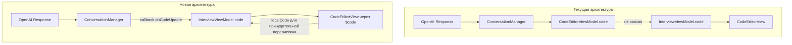

# План упрощения CodeEditorViewModel и исправления отображения кода

## Проблема

Код от GPT успешно парсится и вызывается `setCode()`, но код не отображается на экране.

### Корневая причина

В проекте существовало **дублирование свойства `code`**:

| Компонент | Свойство | Использование |
|-----------|----------|------------|
| `InterviewViewModel` | `@Published var code: String = ""` | Связан с `CodeEditorView` в `MainView` |
| `CodeEditorViewModel` | `@Published var code: String = "func sum(a: Int, b: Int)"` | Использовался в `ConversationManager` |

**Проблемный поток данных:**
```
GPT Response → ConversationManager.setCode(aicode)
              → CodeEditorViewModel.code (обновляется)
              ❌ InterviewViewModel.code (НЕ обновляется)
              ❌ CodeEditorView (НЕ видит изменения)
```

## Решение

Упростить архитектуру, убрав лишний слой абстракции `CodeEditorViewModel`. Использовать только `InterviewViewModel.code` как единственный источник кода.

## Архитектура изменений



## Детальный план реализации

### Шаг 1: Удалить неиспользуемые файлы
- ✅ Удалён `XInterview2/Domain/Controllers/CodeEditorController.swift` - не использовался в проекте
- ✅ Удалён `XInterview2/Presentation/ViewModels/CodeEditorViewModel.swift` - заменён на простой подход

### Шаг 2: Обновить InterviewViewModel

**Файл:** `XInterview2/Presentation/ViewModels/InterviewViewModel.swift`

**Действия:**
- ✅ Убрано `@Published var codeEditorViewModel = CodeEditorViewModel()` (строка21)
- ✅ Добавлено `@Published var codeLanguage: CodeLanguageInterview = .swift` (строка21)
- ✅ Убран параметр `codeEditorViewModel` из инициализаторов (строки48,59)
- ✅ Убрано присваивание `self.codeEditorViewModel = codeEditorViewModel` (строка67)
- ✅ Добавлен callback `conversationManager.onCodeUpdate` для обновления кода от GPT (строка105-107)
- ✅ Добавлен биндинг `$code` для синхронизации изменений кода с `ConversationManager` (строки110-115)
- ✅ Обновлены методы `setCode()` и `updateCodeLanguage()` для синхронизации с `ConversationManager` (строки234-243)

### Шаг 3: Обновить ConversationManager

**Файл:** `XInterview2/Domain/Managers/ConversationManager.swift`

**Действия:**
- ✅ Убрано `private(set) var codeEditorViewModel: CodeEditorViewModel?` (строка39)
- ✅ Добавлен callback `var onCodeUpdate: ((String) -> Void)?` (строка56)
- ✅ Убран параметр `codeEditorViewModel` из инициализатора (строка65)
- ✅ Убрано присваивание `self.codeEditorViewModel = codeEditorViewModel` (строка72)
- ✅ Заменены вызовы `codeEditorViewModel?.setCode(aicode)` на `onCodeUpdate?(aicode)` (строки239,366)
- ✅ Убран вызов `updateCodeContextFromEditor()` из `startConversation` (строка346)
- ✅ Убраны методы `updateCodeContext(from:)`, `updateCodeContextFromEditor()`, `setCodeEditorViewModel(_:)` (строки472-497)
- ✅ Добавлен метод `updateCodeContext(code:language:)` для прямого обновления контекста кода (строки472-478)

### Шаг 4: Обновить MainView

**Файл:** `XInterview2/Presentation/Views/MainView.swift`

**Действия:**
- ✅ Убран пустой callback `onCodeChange` из `CodeEditorView` (строки48-55)
- ✅ `CodeEditorView` уже использует `$viewModel.code` - это правильно

### Шаг 5: Обновить CodeEditorView

**Файл:** `XInterview2/Presentation/Views/CodeEditorView.swift`

**Проблема:** SwiftUI binding может не корректно обновлять `SourceEditor` при изменении через callback.

**Решение:** Использовать локальное состояние `@State var localCode` для принудительной перерисовки при изменении кода.

**Действия:**
- ✅ Добавлено `@State var localCode: String = ""` для локального состояния (строка22)
- ✅ Обновлён `init` для инициализации `localCode` с текущим значением `code` (строки28-40)
- ✅ Обновлён `SourceEditor` для использования `Binding(get:set:)` с `localCode` (строки46-65)
- ✅ Обновлён `.onChange(of: code)` для синхронизации `localCode` при внешних изменениях (строки67-77)
- ✅ Добавлен `.onAppear` для инициализации `localCode` при первом запуске (строка78-80)

## Преимущества нового подхода

1. **Один источник кода** - только `InterviewViewModel.code`
2. **Прозрачный поток данных** - от GPT до экрана через callback `onCodeUpdate`
3. **Меньше кода** - убран лишний слой абстракции
4. **Меньше ошибок** - нет дублирования и рассинхронизации
5. **Принудительная перерисовка** - `localCode` гарантирует обновление `SourceEditor`

## Файлы для изменения

| Файл | Тип изменений |
|-------|---------------|
| `XInterview2/Presentation/ViewModels/CodeEditorViewModel.swift` | Удалён |
| `XInterview2/Domain/Controllers/CodeEditorController.swift` | Удалён |
| `XInterview2/Presentation/ViewModels/InterviewViewModel.swift` | Обновлён |
| `XInterview2/Domain/Managers/ConversationManager.swift` | Обновлён |
| `XInterview2/Presentation/Views/MainView.swift` | Обновлён |
| `XInterview2/Presentation/Views/CodeEditorView.swift` | Обновлён |

## Результат сборки

✅ **BUILD SUCCEEDED** - проект успешно компилируется без ошибок

Предупреждения SwiftLint для `CodeEditTextView` и `CodeEditSourceEditor` не критичны - это только linting предупреждения, а не ошибки компиляции.

## Тестирование

После запуска приложения:
1. Запуск интервью - открывающее сообщение с кодом должно отображаться в редакторе
2. Ответ пользователя с запросом кода - код должен обновляться
3. Редактирование кода пользователем - изменения должны сохраняться

## Архитектура потока данных

```
┌─────────────────────────────────────────────────────────────────────────────┐
│                        GPT Response                             │
└─────────────────────────────────────┬───────────────────────────────────────┘
                              │
                              ▼
                ┌─────────────────────────────────────────────────────┐
                │  ConversationManager.onCodeUpdate?(aicode)  │
                └─────────────────────────────┬───────────────────────┘
                                          │
                                          ▼
                            ┌─────────────────────────────────────────────────────┐
                            │  InterviewViewModel.code (обновляется)  │
                            └─────────────────────────────┬───────────────────────┘
                                                  │
                                                  ▼
                                    ┌─────────────────────────────────────────────────────┐
                                    │  CodeEditorView ($viewModel.code)  │
                                    │  localCode (для принуд. перерисовки) │
                                    └─────────────────────────────┬───────────────────────┘
                                                          │
                                                          ▼
                                                ┌─────────────────────────────────────────────────────┐
                                                │  SourceEditor (отображает код)          │
                                                └─────────────────────────────────────────────────────┘
```
