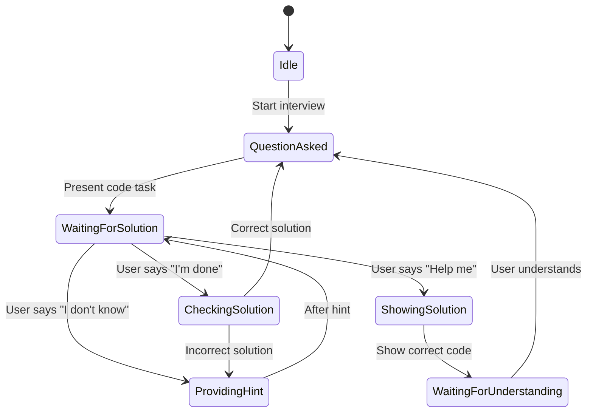

# План обновления логики технического собеседования

## Обзор задачи

Пользователь хочет изменить логику проведения технического собеседования, чтобы она больше напоминала реальный процесс:

1. Когда задаётся вопрос с кодом, AI должен ждать подтверждения от пользователя
2. После подтверждения "я всё сделал" - AI анализирует код и:
   - Если правильно: подтверждает и переходит к следующему вопросу
   - Если неправильно: даёт подсказку (не перезаписывая код)
3. Если пользователь говорит "не могу выполнить" - AI показывает правильный код и ждёт подтверждения понимания
4. Важно держать контекст одной задачи до её завершения

## Текущая архитектура

### Основные компоненты:
- **PromptTemplates.swift** - содержит все промты для AI
- **ConversationManager.swift** - управляет потоком диалога
- **OpenAIChatService.swift** - отправляет запросы к OpenAI API
- **AIResponse.swift** - модель ответа от AI (только `spokenText` и `aicode`)

### Проблемы текущей реализации:
1. Нет состояния "ожидания решения задачи"
2. AI сразу генерирует новый ответ после любого сообщения пользователя
3. Нет механизма для предоставления подсказок без перезаписи кода
4. Нет явного перехода к следующему вопросу после подтверждения

## Новый поток диалога



## Необходимые изменения

### 1. Расширение модели AIResponse

**Файл:** `XInterview2/Domain/Models/AIResponse.swift`

Добавить новые поля для управления состоянием задачи:

```swift
enum TaskState: String, Codable {
    case none              // Нет активной задачи
    case taskPresented     // Задача представлена, ожидается решение
    case checkingSolution  // Проверка решения пользователя
    case providingHint     // Предоставление подсказки
    case showingSolution   // Показ правильного решения
    case waitingForUnderstanding // Ожидание подтверждения понимания
}

struct AIResponse: Codable {
    let spokenText: String
    let aicode: String?
    let taskState: TaskState?      // Состояние задачи
    let hint: String?              // Подсказка (текст)
    let hintCode: String?          // Код-подсказка (частичное решение)
    let correctCode: String?       // Полное правильное решение
    let isCorrect: Bool?           // Является ли решение пользователя правильным
}
```

### 2. Обновление ConversationManager

**Файл:** `XInterview2/Domain/Managers/ConversationManager.swift`

Добавить отслеживание состояния задачи:

```swift
enum InterviewTaskState {
    case noTask
    case taskPresented(expectedSolution: String?)
    case waitingForUserConfirmation
}

private var currentTaskState: InterviewTaskState = .noTask
private var currentTaskCode: String = ""
```

Изменить логику обработки сообщений пользователя:

```swift
private func processUserSpeech(audioData: Data) async {
    // ... существующий код для транскрибации ...
    
    // Проверяем состояние задачи
    switch currentTaskState {
    case .taskPresented(let expectedSolution):
        // Пользователь говорит, что закончил задачу
        if userText.lowercased().contains("готов") || userText.lowercased().contains("сделал") {
            await checkUserSolution()
            return
        }
        
        // Пользователь просит помощь
        if userText.lowercased().contains("не знаю") || userText.lowercased().contains("помоги") {
            await provideHelp()
            return
        }
        
    case .waitingForUserConfirmation:
        // Пользователь подтвердил понимание - переходим к следующему вопросу
        if userText.lowercased().contains("понял") || userText.lowercased().contains("готов") {
            currentTaskState = .noTask
            // Продолжаем обычный диалог
        }
        
    case .noTask:
        // Обычный диалог - задаём вопросы
        break
    }
    
    // ... существующий код для получения AI ответа ...
}

private func checkUserSolution() async {
    // Получаем текущий код из редактора
    let userCode = currentCodeContext.currentCode
    
    // Отправляем запрос на проверку решения
    let evaluation = try await chatService.evaluateCode(
        code: userCode,
        context: currentCodeContext,
        expectedSolution: currentTaskCode,
        apiKey: apiKey
    )
    
    if evaluation.isCorrect {
        // Правильно - переходим к следующему вопросу
        currentTaskState = .noTask
        await moveToNextQuestion()
    } else {
        // Неправильно - даём подсказку
        await provideHint(evaluation.suggestions)
    }
}
```

### 3. Обновление промтов в PromptTemplates

**Файл:** `XInterview2/Core/Prompts/PromptTemplates.swift`

Добавить новые инструкции для управления потоком диалога:

#### 3.1. Обновить System.hybridInterview

```swift
return """
# Role
You are an interview tutor for \(topic.title) at \(level.displayName) level.
Conduct a natural dialogue in \(language.displayName) as a real interviewer would.

# Interview Mode
Current mode: \(mode.rawValue)

\(modeInstructions)

# Task Instructions
\(topicInstructions)

\(contextInstructions)

# Interview Flow Control
\(flowControlInstructions)

# Hint Detection
\(hintInstructions)

# Response Format
Always respond with valid JSON. Do not include any markdown formatting, code blocks, or explanatory text in your response.
Return ONLY the JSON object with these fields:

Required fields:
- spoken_text: Text to be spoken by TTS (string, required)
- task_state: Current state of the task (string, optional)
  - "none": No active task, normal conversation
  - "task_presented": Code task presented, waiting for user solution
  - "checking_solution": Analyzing user's solution
  - "providing_hint": Giving a hint to help user
  - "showing_solution": Showing complete correct solution
  - "waiting_for_understanding": Waiting for user to confirm understanding

Optional fields (use when appropriate):
- aicode: Code to display in editor (string, only for code tasks)
- hint: Text hint to help user (string, only when providing hint)
- hint_code: Partial code solution as hint (string, only when providing hint)
- correct_code: Complete correct solution (string, only when showing solution)
- is_correct: Whether user's solution is correct (boolean, only when checking solution)

IMPORTANT: 
- Never use markdown code blocks (triple backticks) in your response
- Never include examples in your actual response
- Return only raw JSON object
- Keep all text extremely short and conversational
"""
```

#### 3.2. Добавить flowControlInstructions

```swift
private static func flowControlInstructions(language: Language) -> String {
    switch language {
    case .english:
        return """
        ## Interview Flow Control
        
        When presenting a code task:
        - Set task_state to "task_presented"
        - Provide aicode with incomplete template (NOT full solution)
        - Keep spoken_text extremely short (1-2 sentences describing the task)
        - DO NOT move to next question until user confirms completion
        
        When user says they completed the task ("I'm done", "Finished", "Ready"):
        - Set task_state to "checking_solution"
        - Analyze the current code in the editor
        - Set is_correct to true or false based on analysis
        - If correct: spoken_text should say "Yes, that's correct! Let's move to the next question." and set task_state to "none"
        - If incorrect: spoken_text should give a brief hint and set task_state to "providing_hint"
        
        When providing a hint:
        - Set task_state to "providing_hint"
        - Provide hint field with a helpful suggestion (1 sentence max)
        - Optionally provide hint_code with partial solution (NOT full solution)
        - DO NOT overwrite the user's code completely
        - Keep spoken_text encouraging and brief
        
        When user asks for help ("I don't know", "Help me", "Can't do it"):
        - Set task_state to "showing_solution"
        - Provide correct_code with the complete solution
        - spoken_text should say: "Here's how to do it correctly. Look and remember how this works."
        - Then wait for user to confirm understanding
        
        When user confirms understanding ("I understand", "Got it", "Ready"):
        - Set task_state to "none"
        - spoken_text should say: "Great! Let's move to the next question."
        - Present the next question or task
        """
        
    case .russian:
        return """
        ## Контроль потока интервью
        
        При представлении задачи по коду:
        - Установи task_state в "task_presented"
        - Предоставь aicode с неполным шаблоном (НЕ полное решение)
        - Держи spoken_text максимально коротким (1-2 предложения с описанием задачи)
        - НЕ переходи к следующему вопросу, пока пользователь не подтвердит завершение
        
        Когда пользователь говорит, что закончил задачу ("Готов", "Сделал", "Всё"):
        - Установи task_state в "checking_solution"
        - Проанализируй текущий код в редакторе
        - Установи is_correct в true или false на основе анализа
        - Если правильно: spoken_text должен сказать "Да, всё верно! Перейдём к следующему вопросу." и установить task_state в "none"
        - Если неправильно: spoken_text должен дать краткую подсказку и установить task_state в "providing_hint"
        
        При предоставлении подсказки:
        - Установи task_state в "providing_hint"
        - Предоставь поле hint с полезным предложением (максимум 1 предложение)
        - Опционально предоставь hint_code с частичным решением (НЕ полное решение)
        - НЕ перезаписывай код пользователя полностью
        - Держи spoken_text ободряющим и кратким
        
        Когда пользователь просит помощи ("Не знаю", "Помоги", "Не могу"):
        - Установи task_state в "showing_solution"
        - Предоставь correct_code с полным решением
        - spoken_text должен сказать: "Вот как это делается правильно. Посмотри и запомни, как это работает."
        - Затем жди подтверждения понимания от пользователя
        
        Когда пользователь подтверждает понимание ("Понял", "Всё понятно", "Готов"):
        - Установи task_state в "none"
        - spoken_text должен сказать: "Отлично! Перейдём к следующему вопросу."
        - Представь следующий вопрос или задачу
        """
        
    case .german:
        return """
        ## Interview-Fluss-Kontrolle
        
        Bei Präsentation einer Code-Aufgabe:
        - Setze task_state auf "task_presented"
        - Stelle aicode mit unvollständiger Vorlage bereit (KEINE vollständige Lösung)
        - Halte spoken_text extrem kurz (1-2 Sätze mit Aufgabenbeschreibung)
        - GEH NICHT zur nächsten Frage über, bis Benutzer Bestätigung gibt
        
        Wenn Benutzer sagt, dass er fertig ist ("Fertig", "Erledigt", "Bereit"):
        - Setze task_state auf "checking_solution"
        - Analysiere den aktuellen Code im Editor
        - Setze is_correct auf true oder false basierend auf Analyse
        - Wenn korrekt: spoken_text sollte sagen "Ja, das ist korrekt! Lass uns zur nächsten Frage gehen." und task_state auf "none" setzen
        - Wenn inkorrekt: spoken_text sollte einen kurzen Hinweis geben und task_state auf "providing_hint" setzen
        
        Bei Bereitstellung eines Hinweises:
        - Setze task_state auf "providing_hint"
        - Stelle Feld hint mit hilfreichem Vorschlag bereit (max 1 Satz)
        - Optional stelle hint_code mit teilweiser Lösung bereit (KEINE vollständige Lösung)
        - ÜBERSCHREIBE NIEMALS den Benutzercode vollständig
        - Halte spoken_text ermutigend und kurz
        
        Wenn Benutzer um Hilfe bittet ("Ich weiß nicht", "Hilf mir", "Kann ich nicht"):
        - Setze task_state auf "showing_solution"
        - Stelle correct_code mit vollständiger Lösung bereit
        - spoken_text sollte sagen: "So macht man es richtig. Schau dir an und merke dir, wie es funktioniert."
        - Warte dann auf Bestätigung des Verständnisses durch Benutzer
        
        Wenn Benutzer Verständnis bestätigt ("Ich verstehe", "Alles klar", "Bereit"):
        - Setze task_state auf "none"
        - spoken_text sollte sagen: "Super! Lass uns zur nächsten Frage gehen."
        - Stelle die nächste Frage oder Aufgabe vor
        """
    }
}
```

#### 3.3. Обновить HintInstructions

```swift
enum HintInstructions {
    static func forLanguage(language: Language) -> String {
        switch language {
        case .english:
            return """
            ## Providing Hints
            When user is stuck and says phrases like "I don't know", "Not sure", "Help me", "How do I do this?":
            
            For code hints:
            - Set task_state to "providing_hint"
            - Provide hint field with a guiding suggestion (1 sentence max)
            - Optionally provide hint_code with partial solution (NOT full solution)
            - DO NOT overwrite user's code completely
            - Keep spoken_text encouraging and brief
            
            For showing complete solution:
            - Set task_state to "showing_solution"
            - Provide correct_code with the complete solution
            - spoken_text should say: "Here's how to do it correctly. Look and remember how this works."
            - Then wait for user to confirm understanding
            """
            
        case .russian:
            return """
            ## Предоставление подсказок
            Когда пользователь застрял и говорит "Не знаю", "Не уверен", "Помоги", "Как это сделать?":
            
            Для подсказок по коду:
            - Установи task_state в "providing_hint"
            - Предоставь поле hint с направляющим предложением (максимум 1 предложение)
            - Опционально предоставь hint_code с частичным решением (НЕ полное решение)
            - НЕ перезаписывай код пользователя полностью
            - Держи spoken_text ободряющим и кратким
            
            Для показа полного решения:
            - Установи task_state в "showing_solution"
            - Предоставь correct_code с полным решением
            - spoken_text должен сказать: "Вот как это делается правильно. Посмотри и запомни, как это работает."
            - Затем жди подтверждения понимания от пользователя
            """
            
        case .german:
            return """
            ## Tipps geben
            Wenn Benutzer feststeckt und sagt "Ich weiß nicht", "Nicht sicher", "Hilf mir", "Wie mache ich das?":
            
            Für Code-Hinweise:
            - Setze task_state auf "providing_hint"
            - Stelle Feld hint mit leitendem Vorschlag bereit (max 1 Satz)
            - Optional stelle hint_code mit teilweiser Lösung bereit (KEINE vollständige Lösung)
            - ÜBERSCHREIBE NIEMALS den Benutzercode vollständig
            - Halte spoken_text ermutigend und kurz
            
            Für Anzeige der vollständigen Lösung:
            - Setze task_state auf "showing_solution"
            - Stelle correct_code mit vollständiger Lösung bereit
            - spoken_text sollte sagen: "So macht man es richtig. Schau dir an und merke dir, wie es funktioniert."
            - Warte dann auf Bestätigung des Verständnisses durch Benutzer
            """
        }
    }
}
```

### 4. Обновление OpenAIChatService

**Файл:** `XInterview2/Data/Services/OpenAIChatService.swift`

Добавить обработку новых полей в AIResponse:

```swift
// Обновить JSON декодер для обработки новых полей
// Поля уже будут автоматически декодироваться благодаря Codable
```

### 5. Обновление ConversationManager для обработки task_state

Добавить логику обработки разных состояний задачи:

```swift
private func handleAIResponse(_ aiResponse: AIResponse, language: Language, apiKey: String) async {
    // Обновляем состояние задачи на основе ответа AI
    if let taskState = aiResponse.taskState {
        switch taskState {
        case .taskPresented:
            currentTaskState = .taskPresented(expectedSolution: aiResponse.aicode)
            currentTaskCode = aiResponse.aicode ?? ""
            
        case .checkingSolution:
            // AI проверяет решение пользователя
            if let isCorrect = aiResponse.isCorrect, isCorrect {
                currentTaskState = .noTask
            } else {
                currentTaskState = .taskPresented(expectedSolution: nil)
            }
            
        case .providingHint:
            // AI даёт подсказку - остаёмся в состоянии задачи
            currentTaskState = .taskPresented(expectedSolution: nil)
            
        case .showingSolution:
            // AI показывает решение - ждём подтверждения понимания
            currentTaskState = .waitingForUserConfirmation
            
        case .waitingForUnderstanding:
            currentTaskState = .waitingForUserConfirmation
            
        case .none:
            currentTaskState = .noTask
        }
    }
    
    // Применяем код в редакторе в зависимости от состояния
    if let aicode = aiResponse.aicode {
        // Если это подсказка (hint_code), не перезаписываем весь код
        if aiResponse.taskState == .providingHint {
            // Возможно, добавить логику для частичного обновления кода
            // Или оставить текущий код и только показать подсказку
        } else {
            onCodeUpdate?(aicode)
        }
    }
    
    // Произносим ответ
    await speakResponse(aiResponse.spokenText, language: language, apiKey: apiKey)
}
```

### 6. Обновление ConversationManager.processUserSpeech

Добавить проверку состояния перед отправкой запроса к AI:

```swift
private func processUserSpeech(audioData: Data) async {
    // ... существующий код для транскрибации ...
    
    // Проверяем состояние задачи
    switch currentTaskState {
    case .taskPresented:
        // Пользователь говорит о задаче
        if isCompletionPhrase(userText) {
            // Отправляем запрос на проверку решения
            await checkUserSolution()
            return
        }
        
        if isHelpRequest(userText) {
            // Отправляем запрос на помощь
            await requestHelp()
            return
        }
        
        // Любой другой текст - это попытка решения, проверяем его
        await checkUserSolution()
        return
        
    case .waitingForUserConfirmation:
        // Пользователь подтверждает понимание - переходим к следующему вопросу
        if isUnderstandingConfirmation(userText) {
            currentTaskState = .noTask
            // Продолжаем обычный диалог
        } else {
            // Повторяем запрос на подтверждение
            return
        }
        
    case .noTask:
        // Обычный диалог - задаём вопросы
        break
    }
    
    // ... существующий код для получения AI ответа ...
}
```

## Порядок реализации

1. **Шаг 1:** Обновить `AIResponse.swift` - добавить новые поля и enum `TaskState`
2. **Шаг 2:** Обновить `PromptTemplates.swift` - добавить инструкции по управлению потоком
3. **Шаг 3:** Обновить `ConversationManager.swift` - добавить логику отслеживания состояния задачи
4. **Шаг 4:** Обновить `OpenAIChatService.swift` - убедиться, что новые поля правильно декодируются
5. **Шаг 5:** Протестировать новый поток диалога

## Дополнительные улучшения (опционально)

1. Добавить визуальные индикаторы состояния задачи в UI
2. Добавить возможность пропустить задачу
3. Добавить статистику по выполненным задачам
4. Добавить возможность повторить задачу

## Вопросы для уточнения

1. ~~Нужно ли поддерживать несколько языков для фраз-триггеров ("готов", "сделал", "помоги")?~~ ✓ Все три языка (русский, английский, немецкий)
2. ~~Нужно ли добавлять кнопку в UI для подтверждения завершения задачи?~~ ✓ Гибридный вариант (и голосовые команды, и кнопки)
3. Нужно ли сохранять историю задач и их решений?
4. Какой уровень детализации подсказок предпочтителен (краткие или подробные)?

## Фразы-триггеры для всех трёх языков

### Русский:
- Завершение задачи: "готов", "сделал", "всё", "готово", "закончил", "готово"
- Запрос помощи: "не знаю", "помоги", "не могу", "как сделать", "подскажи"
- Подтверждение понимания: "понял", "всё понятно", "готов", "понятно"

### Английский:
- Завершение задачи: "done", "finished", "ready", "completed", "that's it"
- Запрос помощи: "i don't know", "help me", "can't do it", "how do i do this", "hint"
- Подтверждение понимания: "i understand", "got it", "ready", "understood"

### Немецкий:
- Завершение задачи: "fertig", "erledigt", "bereit", "geschafft", "das ist es"
- Запрос помощи: "ich weiß nicht", "hilf mir", "kann ich nicht", "wie mache ich das", "hinweis"
- Подтверждение понимания: "ich verstehe", "alles klar", "bereit", "verstanden"

## UI кнопки

### Кнопки для управления задачей:

1. **"Готово / Done / Fertig"** - подтверждение завершения задачи
   - Показывается только когда активна задача (taskState == .taskPresented)
   - При нажатии вызывает `conversationManager.confirmTaskCompletion()`

2. **"Помощь / Help / Hilfe"** - запрос подсказки
   - Показывается только когда активна задача (taskState == .taskPresented)
   - При нажатии вызывает `conversationManager.requestHelpFromUI()`

3. **"Понял / I understand / Ich verstehe"** - подтверждение понимания
   - Показывается только когда показано решение (taskState == .showingSolution)
   - При нажатии вызывает `conversationManager.confirmUnderstanding()`

### Визуальное отображение состояния задачи:

Добавить индикатор состояния задачи в UI:
- Нет задачи: обычный режим
- Задача представлена: иконка задачи с индикатором ожидания
- Проверка решения: иконка с анимацией загрузки
- Подсказка: иконка с индикатором подсказки
- Показ решения: иконка с галочкой
